# Interpretable Pulmonary-Nodule Malignancy Scoring: Prediction, WHERE, WHAT, WHY, and HOW

**Author:** [To be completed]

**Affiliation:** [To be completed]

**Supervisor:** [To be completed]

**Date:** 2026-08-13

**Keywords:** LIDC-IDRI; concept bottleneck; Grad-CAM; intervention; explainability

## Abstract

This study evaluates four three-dimensional deep-learning strategies for radiologist-assessed pulmonary-nodule malignancy using a frozen cohort of 2,633 nodules from 868 patients. The primary endpoint is pooled out-of-fold mean absolute error on the original 1–5 rating scale; secondary evidence covers the 1,073-nodule extreme subset, eight bottleneck concepts, centered score contributions, concept interventions, and spatial Grad-CAM faithfulness. The evidence is organised as Prediction, WHERE, WHAT, WHY, and HOW rather than as an audit inventory.

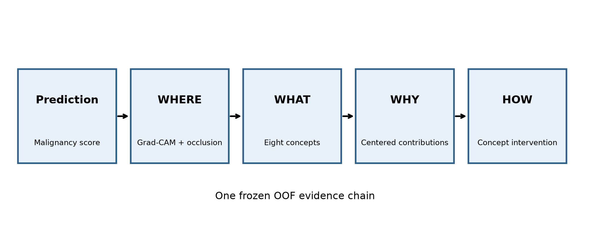

**RPT-F01.** End-to-end evidence framework linking prediction to WHERE, WHAT, WHY, and HOW.

Learned-softmax GAM achieved the lowest primary point-estimate MAE of 0.480, compared with 0.501 for Black-box. Across all models, 73,724 Grad-CAM targets were requested: 66,769 were valid and 6,955 were explicitly recorded as post-ReLU all-zero maps. Matched-random occlusion showed that spatial saliency was not uniformly more faithful than random masks, while concept interventions produced model- and ordering-dependent changes.

The findings support a layered interpretation: accurate prediction does not by itself establish spatial or conceptual faithfulness; concept fidelity does not guarantee beneficial intervention; and additive contribution decompositions describe the model score without establishing clinical causality. Malignancy is a radiologist assessment rather than pathology-confirmed diagnosis, and the system is not a clinical diagnostic product.

## 1. Introduction

Pulmonary-nodule malignancy assessment combines a prediction problem with an explanation problem. A numeric malignancy score can be useful for benchmarking, yet a reader also needs to know where the image influenced the model, what radiological concepts the model represented, why those representations shifted the output, and how the output responds when concept information is corrected. Treating these as interchangeable forms of explanation obscures their different evidential roles.

We therefore frame the analysis around five linked questions. Prediction asks whether the continuous radiologist-assessed target is estimated accurately. WHERE uses Grad-CAM and matched occlusion to evaluate spatial sensitivity. WHAT measures the fidelity of six continuous and two categorical concept predictions. WHY decomposes concept-model scores into train-centered signed contributions and learned local-expert mixtures. HOW tests model dependence through preregistered concept interventions.

The contribution is not a new clinical classifier or a claim of pathology-level diagnosis. It is a controlled comparison of Black-box, Standard CBM, a project-specific Mixed-type CEM, and a preregistered Learned-softmax GAM under identical patient-grouped folds, shared encoder initialisations, exactly-once test evaluation, and a unified OOF analysis. The report keeps negative findings visible, including uncertain paired AUROC differences, limited categorical concept fidelity, model-dependent intervention benefit, and concentrated zero-map behaviour.

## 2. Related Work

LIDC-IDRI provides a public thoracic-CT reference database with multi-reader nodule annotations [1]. Earlier pulmonary-nodule systems used local image patches and convolutional networks to predict malignancy suspiciousness; MC-CNN, for example, linked multiscale image features to suspiciousness and selected semantic attributes [9]. These studies motivate volumetric image modelling but also underline a crucial boundary retained here: LIDC malignancy is a reader assessment, not pathology-confirmed diagnosis.

**RPT-T01. Related-work comparison**

| Approach | Prediction | Concepts | Spatial explanation | Intervention | This study |
| --- | --- | --- | --- | --- | --- |
| Black-box CNN | Yes | No | Optional | No | Comparator |
| Concept Bottleneck Model | Yes | Explicit | Concept/task Grad-CAM | Concept replacement | Standard CBM |
| Concept Embedding Model | Yes | Mixed-type embeddings | Concept/task Grad-CAM | Mixture-weight replacement | Project-specific Mixed-type CEM |
| Additive local experts | Yes | Explicit | Concept/task Grad-CAM | Local-expert re-evaluation | Preregistered Learned-softmax GAM |

DenseNet improved feature reuse and gradient flow [2], motivating the common DenseNet-121 encoder used in all four models. Concept bottleneck models made intermediate variables directly inspectable and correctable [3]. Concept embedding models replaced scalar bottlenecks with sample-conditioned representations and reported a different accuracy–intervention trade-off [4]. The present Mixed-type CEM is a project-specific extension for six continuous and two categorical vote-distribution targets, not a claim to reproduce the original CEM unchanged.

Generalized additive models express an output as a sum of component functions [5]. Dumaev et al. combined concept-based learning and additive decision explanation specifically for LIDC-IDRI pulmonary-nodule malignancy scoring [8], making that study the closest task-level precedent. The preregistered Learned-softmax GAM here differs materially: each concept group has five local neural experts mixed by learned fold-level softmax weights, while the model is trained and evaluated under the present frozen patient-grouped protocol.

Grad-CAM uses target gradients at a convolutional layer to form a coarse spatial sensitivity map [6]. A visually concentrated map, however, is not automatically faithful. This study therefore compares deterministic saliency masks with 20 equal-size random masks and preserves output_sensitivity separately from error_increase. Likewise, concept intervention is not guaranteed to improve performance: later analyses have shown strong dependence on intervention selection and granularity [7]. Table RPT-T01 positions these methods without importing prior-work results into the present cohort.

These model families expose different objects. A scalar CBM exposes predicted concept values; a CEM exposes sample-conditioned concept states; an additive model exposes score components; and Grad-CAM exposes target-dependent spatial sensitivity. None is automatically a ground-truth explanation. A concept can be predicted accurately yet used in a brittle way, a contribution can reconstruct the score yet remain clinically non-causal, and a spatial map can look plausible while failing an occlusion comparison. The present evaluation therefore keeps these claims separate instead of treating transparency as one binary property.

Pulmonary-nodule studies also differ in cohort identity, label construction, split unit, and reporting scale. Direct numerical comparison is unsafe when prior work uses a different physical-nodule reconciliation, binary suspiciousness target, or image-sampling protocol. Prior work is therefore used here to motivate methods and interpretation boundaries, while all performance claims come only from the frozen 2,633-nodule Baseline-v2 analysis. This is especially important for the closely related Dumaev study [8]: its published cohort statistics are not inserted into the present cohort flow.

## 3. Dataset and Preprocessing

The study uses the LIDC-IDRI XML reader annotations and stable physical-nodule identities. The frozen primary cohort contains 2,633 nodules from 868 patients; 1,073 nodules from 578 patients satisfy the preregistered extreme definition, with 782 low and 291 high cases. Patient Diagnoses XLS is not used for training, and malignancy is the mean of valid radiologist ratings rather than a pathology-confirmed label.

**RPT-T02. Frozen cohort flow**

| Cohort component | Nodules | Patients | Role |
| --- | --- | --- | --- |
| Primary regression | 2633 | 868 | Main five-fold evaluation |
| Secondary extreme subset | 1073 | 578 | 782 low / 291 high |

Malignancy is the downstream 1–5 target and is not one of the eight bottleneck concepts. The concepts are subtlety, internalStructure, calcification, sphericity, margin, lobulation, spiculation, and texture. Six targets are continuous normalized reader means; internalStructure and calcification retain complete reader vote distributions, including true modal ties for training and soft metrics.

**RPT-T03. Target and concept definitions**

| Variable | Role | Type | Frozen target |
| --- | --- | --- | --- |
| Malignancy | Downstream target (not a concept) | Continuous | Radiologist mean, 1–5; normalized (y−1)/4 |
| subtlety | Bottleneck concept | Continuous | Normalized valid-reader mean |
| sphericity | Bottleneck concept | Continuous | Normalized valid-reader mean |
| margin | Bottleneck concept | Continuous | Normalized valid-reader mean |
| lobulation | Bottleneck concept | Continuous | Normalized valid-reader mean |
| spiculation | Bottleneck concept | Continuous | Normalized valid-reader mean |
| texture | Bottleneck concept | Continuous | Normalized valid-reader mean |
| internalStructure | Bottleneck concept | Categorical (4 classes) | Full reader vote distribution |
| calcification | Bottleneck concept | Categorical (6 classes) | Full reader vote distribution |

Each model receives a 64 × 64 × 64 local pulmonary-nodule ROI created by consensus-mask cropping, cubic padding, and deterministic resampling. The ROI is not a complete axial CT slice and can appear lower-resolution because it has been cropped and resampled. Full axial CT is used only as private contextual visualization when exact frozen series, slice, bounding-box, and coordinate provenance are available. Figure RPT-F02 and Tables RPT-T02–RPT-T03 show the study-specific cohort and variables.

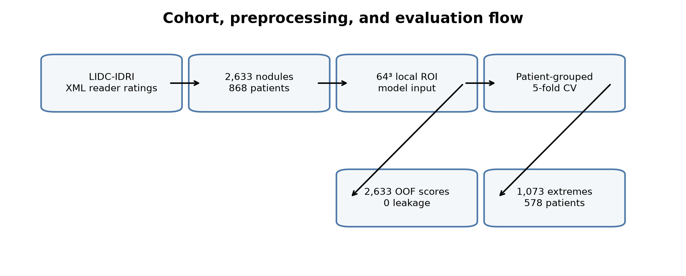

**RPT-F02.** Frozen cohort, local ROI preprocessing, and patient-grouped five-fold evaluation flow.

## 4. Methods

All four models share the same fold-specific DenseNet-121 encoder initialisation and use an unconstrained linear malignancy output. Scores are trained and evaluated without sigmoid, tanh, or clipping. Black-box maps encoder features directly to the score. Standard CBM first learns the eight concepts and then fits a linear task head using frozen predicted concepts. Mixed-type CEM forms sample-conditioned states for continuous and categorical concepts. Learned-softmax GAM applies five local experts to each predicted concept group and adds their softmax-weighted outputs.

**RPT-T04. Four-model architecture comparison**

| Model | Task path | Concept representation | Contribution semantics | Intervention semantics |
| --- | --- | --- | --- | --- |
| Black-box | DenseNet features → linear score | None | Not applicable | Not applicable |
| Standard CBM | Predicted concepts → linear score | 6 sigmoid + 2 softmax groups | Linear group terms | Replace activated concept group |
| Mixed-type CEM | Sample-conditioned concept embeddings → linear score | Mixed-type dynamic states | Embedding block dot product | Replace mixture weights only |
| Learned-softmax GAM | Predicted concepts → local experts → additive score | 6 sigmoid + 2 softmax groups | Softmax-weighted local experts | Ground-truth concept through experts |

Concept-model contributions are centred using means computed only from the current training fold. The centered bias plus eight centered contributions reconstructs the normalized score, and multiplying contributions by 4 reconstructs the original rating-point scale. These signed terms describe how the trained model composes its output; centering constants are bookkeeping statistics, not feature importance. The unavailable mean absolute aggregate is not recreated for presentation.

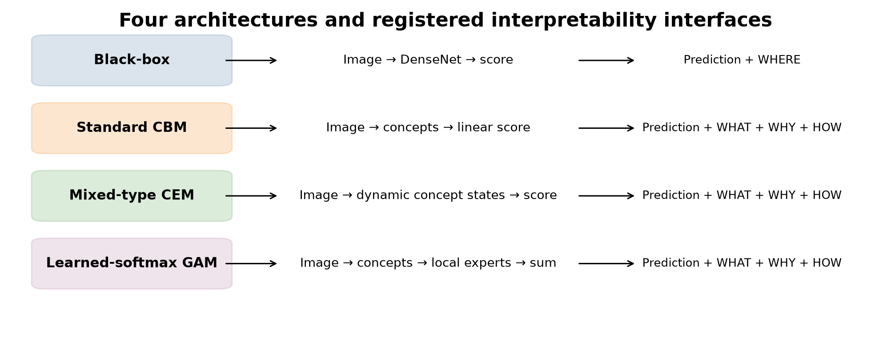

**RPT-F03.** Four model architectures and their registered interpretability interfaces.

Grad-CAM uses the final registered convolutional layer, spatial-mean gradients, a weighted activation sum, ReLU, and trilinear upsampling to 64³. Maps remain raw FP32 scientific artifacts. Display overlays may be normalized only for visualization. A zero post-ReLU map is marked undefined and excluded from the occlusion denominator; the frozen artifacts do not contain the pre-ReLU, gradient-norm, activation-norm, or channel-weight decomposition required to infer its exact mechanism.

Occlusion replaces the top 26,215 heatmap voxels with normalized zero and compares them with 20 uniform-without-replacement random masks of equal size. output_sensitivity is the absolute output movement. error_increase is the change in absolute target error and is positive only when prediction error worsens. Intervention curves replace 0…8 concept groups under shared random permutations or error-first ordering; positive Delta_iMAE and Delta_iAUC consistently denote improvement. Figure RPT-F03 and Table RPT-T04 summarise model semantics; the statistical protocol is reported once in Experimental Setup.

Continuous and categorical targets require different statistical treatments. Continuous attributes use sigmoid predictions against normalized reader means. Categorical attributes use softmax probabilities against complete reader vote distributions, so a convenient modal display label never replaces the scientific target. The pooled metrics are therefore reported on independent scales: errors and correlations for continuous concepts, and soft cross-entropy, multiclass Brier score, and tie-aware hard modal macro-F1 for categorical concepts.

The architectures also support different intervention semantics. Standard CBM replaces activated concept values before its linear head. Mixed-type CEM replaces mixture weights while preserving sample-conditioned states. Learned-softmax GAM recomputes affected local experts from ground-truth concepts while retaining learned alpha. These operations test dependence on each model's own concept interface and are not homogenised into a mathematically different common intervention.

## 5. Experimental Setup

Evaluation uses patient-grouped five-fold outer cross-validation with fixed test counts of 479, 502, 539, 549, and 564 nodules. Patients are disjoint within each fold partition, and every primary nodule appears exactly once in the canonical OOF test set. Fold-specific validation subsets select checkpoints and Youden-J thresholds; test labels never enter selection.

**RPT-T05. Frozen training configuration**

| Setting | Frozen value |
| --- | --- |
| Input / encoder | 64³ nodule ROI / DenseNet-121 (shared fold initialization) |
| Optimizer | Adam; β=(0.9, 0.999); ε=1e-7; weight decay=0 |
| Initial learning rate / batch | 1e-4 / true micro-batch 16; no accumulation; drop_last=False |
| Epoch budget | 80 per registered stage; no early stopping |
| Scheduler | validation objective; factor 0.9 after 4 bad epochs; min_delta=1e-4; minimum LR=0 |
| Train-only augmentation | axial rotation ±15° (p=0.5); H/W flips p=0.5; z reversal p=0.5 |
| Precision / determinism | FP32; AMP/BF16/CUDA-matmul-TF32/cuDNN-TF32 off; deterministic warn-only |
| Formal accelerator | NVIDIA H200 |
| Black-box objective | MSE on unclipped normalized malignancy score |
| Standard CBM objective | 80-epoch concept loss, then 80-epoch linear task-head MSE on frozen predicted concepts |
| Mixed-type CEM objective | task MSE + 0.01 × mean eight-group concept loss |
| Learned-softmax GAM objective | task MSE + mean eight-group concept loss |

The frozen training configuration uses DenseNet-121, Adam at 1e-4, true batch 16, an 80-epoch budget, train-only deterministic augmentation, FP32 computation with AMP/BF16/TF32 disabled, and NVIDIA H200 hardware. Model-specific loss structures are retained in Table RPT-T05. Test evaluation is committed exactly once after the best checkpoint is fixed; per-fold best epochs and scheduler provenance remain in the reproducibility evidence rather than the scientific training table.

**RPT-T06. Evaluation protocol**

| Component | Unit | Metric | Selection/uncertainty |
| --- | --- | --- | --- |
| Primary regression | Nodule; patient-cluster bootstrap | Unclipped original-scale MAE (primary), RMSE, normalized MAE, Pearson, Spearman | 2,000 shared patient draws |
| Secondary extreme | 1,073 extreme nodules / 578 patients | AUROC, AUPRC; threshold metrics | Fold-validation extreme-only Youden-J; 2,000 valid draws |
| Concept fidelity | Nodule | Continuous MAE/RMSE/correlation; categorical CE/Brier/macro-F1 | Hard F1 excludes true modal ties |
| Spatial faithfulness | Valid Grad-CAM target | output_sensitivity and error_increase | 26,215 voxels; 20 matched random masks |
| Intervention | Pooled OOF | iMAE/Delta_iMAE; iAUC/Delta_iAUC | k=0…8; random and error-first orderings |

Uncertainty uses 2,000 patient-cluster bootstrap replicates, with shared patient draws for paired comparisons. Each selected patient carries all of their nodules. Secondary AUROC draws are redrawn when they contain a single class. Table RPT-T05 records frozen training settings, while Table RPT-T06 defines evaluation and uncertainty without duplicating Methods.

### 6.1 Results — Prediction

What was measured? Primary prediction was evaluated on all 2,633 OOF nodules with original-scale MAE as the primary endpoint. Learned-softmax GAM produced the lowest point estimate (0.480), followed by Mixed-type CEM (0.484), Black-box (0.501), and Standard CBM (0.502). Table RPT-T07 reports every frozen regression point estimate and its existing 2,000-draw interval; Figure RPT-F04 makes the overlap in uncertainty visible.

**RPT-T07. Primary regression**

| Model | MAE (95% CI) | RMSE (95% CI) | Normalized MAE (95% CI) | Pearson (95% CI) | Spearman (95% CI) | Prediction range (1–5) | N |
| --- | --- | --- | --- | --- | --- | --- | --- |
| Black-box | 0.501 (0.483–0.520) | 0.642 (0.619–0.667) | 0.125 (0.121–0.130) | 0.716 (0.689–0.741) | 0.635 (0.599–0.668) | 0.489–5.120 | 2633 |
| Learned-softmax GAM | 0.480 (0.462–0.498) | 0.618 (0.592–0.642) | 0.120 (0.116–0.125) | 0.741 (0.712–0.768) | 0.653 (0.616–0.688) | 1.008–4.682 | 2633 |
| Mixed-type CEM | 0.484 (0.467–0.502) | 0.628 (0.604–0.654) | 0.121 (0.117–0.126) | 0.730 (0.701–0.757) | 0.640 (0.604–0.673) | 0.823–4.935 | 2633 |
| Standard CBM | 0.502 (0.483–0.522) | 0.650 (0.625–0.675) | 0.126 (0.121–0.131) | 0.708 (0.677–0.735) | 0.609 (0.570–0.648) | 0.858–4.580 | 2633 |

What did we observe? Paired Delta-MAE supports Learned-softmax GAM over Black-box and Standard CBM because the corresponding intervals do not cross zero, whereas smaller differences require a more cautious reading. The Black-box versus Standard CBM interval crosses zero, showing that interpretability structure did not automatically improve point prediction. Table RPT-T08 and Figure RPT-F05 preserve all six comparisons and the sign convention MAE_A − MAE_B. In the reader-facing tables, No supported difference means that the paired 95% CI crosses zero.

**RPT-T08. Six paired Delta-MAE comparisons**

| Comparison (A vs B) | Delta-MAE (A−B) | 95% CI | Crosses zero | Sign convention | Supported conclusion |
| --- | --- | --- | --- | --- | --- |
| Black-box vs Learned-softmax GAM | 0.020 | 0.010–0.031 | False | Positive Δ favors B | Supports B |
| Black-box vs Mixed-type CEM | 0.016 | 0.006–0.027 | False | Positive Δ favors B | Supports B |
| Black-box vs Standard CBM | -0.002 | -0.015–0.012 | True | Positive Δ favors B | No supported difference |
| Mixed-type CEM vs Learned-softmax GAM | 0.004 | -0.006–0.013 | True | Positive Δ favors B | No supported difference |
| Standard CBM vs Learned-softmax GAM | 0.022 | 0.011–0.033 | False | Positive Δ favors B | Supports B |
| Standard CBM vs Mixed-type CEM | 0.018 | 0.006–0.030 | False | Positive Δ favors B | Supports B |

On the 1,073-nodule extreme subset, all four continuous scores discriminated low from high ratings, but paired Delta-AUROC evidence was less decisive than the MAE evidence. Several intervals cross zero, and Standard CBM is lower than Black-box under the registered B−A convention. Table RPT-T09, Table RPT-T10, and Figure RPT-F06 therefore separate absolute AUROC/AUPRC performance from between-model uncertainty.

**RPT-T09. Extreme-task performance**

| Model | AUROC (95% CI) | AUPRC (95% CI) | Sensitivity | Specificity | Balanced accuracy | N |
| --- | --- | --- | --- | --- | --- | --- |
| Black-box | 0.945 (0.926–0.962) | 0.894 (0.859–0.925) | 0.801 | 0.927 | 0.864 | 1073 |
| Learned-softmax GAM | 0.949 (0.927–0.968) | 0.903 (0.868–0.934) | 0.859 | 0.894 | 0.876 | 1073 |
| Mixed-type CEM | 0.942 (0.920–0.960) | 0.877 (0.833–0.916) | 0.832 | 0.923 | 0.877 | 1073 |
| Standard CBM | 0.933 (0.911–0.951) | 0.866 (0.826–0.900) | 0.825 | 0.866 | 0.845 | 1073 |

What does this mean? Learned-softmax GAM is the strongest point-estimate regressor in this experiment, but the result does not justify a universal ranking across endpoints. Unclipped score ranges and small out-of-range rates remain part of the model behaviour rather than being hidden by post-hoc clipping. The target is a radiologist mean, so predictive accuracy should not be interpreted as pathology-level diagnostic accuracy.

**RPT-T10. Six paired Delta-AUROC comparisons**

| Comparison (A vs B) | Delta-AUROC (B−A) | 95% CI | Crosses zero | Sign convention | Supported conclusion |
| --- | --- | --- | --- | --- | --- |
| Black-box vs Learned-softmax GAM | 0.004 | -0.005–0.014 | True | Positive Δ favors B | No supported difference |
| Black-box vs Mixed-type CEM | -0.004 | -0.013–0.005 | True | Positive Δ favors B | No supported difference |
| Black-box vs Standard CBM | -0.013 | -0.022–-0.004 | False | Positive Δ favors B | Supports A |
| Mixed-type CEM vs Learned-softmax GAM | 0.008 | -0.001–0.018 | True | Positive Δ favors B | No supported difference |
| Standard CBM vs Learned-softmax GAM | 0.017 | 0.006–0.027 | False | Positive Δ favors B | Supports B |
| Standard CBM vs Mixed-type CEM | 0.009 | -0.002–0.020 | True | Positive Δ favors B | No supported difference |

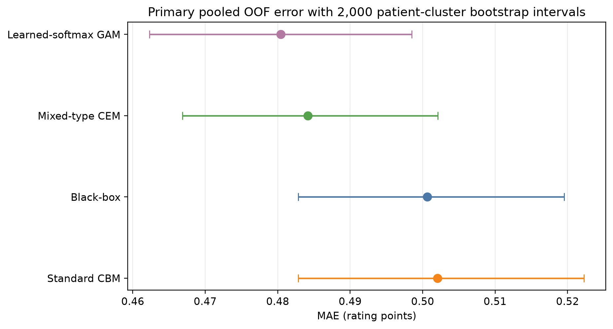

**RPT-F04.** Pooled primary MAE with 2,000 patient-cluster bootstrap 95% intervals.

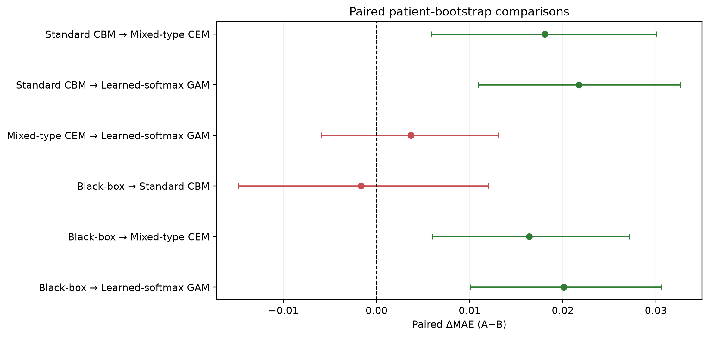

**RPT-F05.** Six paired Delta-MAE comparisons; intervals crossing zero are shown separately.

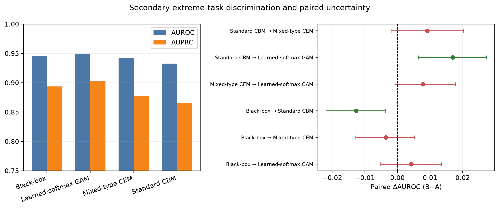

**RPT-F06.** Extreme-task AUROC/AUPRC and six paired Delta-AUROC comparisons.

### 6.2 Results — WHERE

What was measured? Spatial evidence comprises 73,724 requested Grad-CAM maps across all model, fold, and target combinations. Exactly 66,769 maps were valid and 6,955 were post-ReLU all-zero, yielding an overall undefined rate of 9.434%. Table RPT-T13 provides full accounting, while Figure RPT-F07 reveals concentrations that a pooled count would conceal.

**RPT-T13. Grad-CAM accounting**

| Model | Fold | Target | Requested | Valid | Undefined | Undefined rate |
| --- | --- | --- | --- | --- | --- | --- |
| Black-box | 0 | malignancy | 479 | 479 | 0 | 0.000 |
| Black-box | 1 | malignancy | 502 | 502 | 0 | 0.000 |
| Black-box | 2 | malignancy | 539 | 539 | 0 | 0.000 |
| Black-box | 3 | malignancy | 549 | 448 | 101 | 0.184 |
| Black-box | 4 | malignancy | 564 | 461 | 103 | 0.183 |
| Learned-softmax GAM | 0 | calcification | 479 | 422 | 57 | 0.119 |
| Learned-softmax GAM | 0 | internalStructure | 479 | 453 | 26 | 0.054 |
| Learned-softmax GAM | 0 | lobulation | 479 | 475 | 4 | 0.008 |
| Learned-softmax GAM | 0 | malignancy | 479 | 472 | 7 | 0.015 |
| Learned-softmax GAM | 0 | margin | 479 | 412 | 67 | 0.140 |
| Learned-softmax GAM | 0 | sphericity | 479 | 479 | 0 | 0.000 |
| Learned-softmax GAM | 0 | spiculation | 479 | 459 | 20 | 0.042 |
| Learned-softmax GAM | 0 | subtlety | 479 | 477 | 2 | 0.004 |
| Learned-softmax GAM | 0 | texture | 479 | 418 | 61 | 0.127 |
| Learned-softmax GAM | 1 | calcification | 502 | 482 | 20 | 0.040 |
| Learned-softmax GAM | 1 | internalStructure | 502 | 459 | 43 | 0.086 |
| Learned-softmax GAM | 1 | lobulation | 502 | 439 | 63 | 0.125 |
| Learned-softmax GAM | 1 | malignancy | 502 | 463 | 39 | 0.078 |
| Learned-softmax GAM | 1 | margin | 502 | 497 | 5 | 0.010 |
| Learned-softmax GAM | 1 | sphericity | 502 | 473 | 29 | 0.058 |
| Learned-softmax GAM | 1 | spiculation | 502 | 484 | 18 | 0.036 |
| Learned-softmax GAM | 1 | subtlety | 502 | 502 | 0 | 0.000 |
| Learned-softmax GAM | 1 | texture | 502 | 499 | 3 | 0.006 |
| Learned-softmax GAM | 2 | calcification | 539 | 525 | 14 | 0.026 |
| Learned-softmax GAM | 2 | internalStructure | 539 | 494 | 45 | 0.083 |
| Learned-softmax GAM | 2 | lobulation | 539 | 528 | 11 | 0.020 |
| Learned-softmax GAM | 2 | malignancy | 539 | 514 | 25 | 0.046 |
| Learned-softmax GAM | 2 | margin | 539 | 539 | 0 | 0.000 |
| Learned-softmax GAM | 2 | sphericity | 539 | 537 | 2 | 0.004 |
| Learned-softmax GAM | 2 | spiculation | 539 | 367 | 172 | 0.319 |
| Learned-softmax GAM | 2 | subtlety | 539 | 539 | 0 | 0.000 |
| Learned-softmax GAM | 2 | texture | 539 | 472 | 67 | 0.124 |
| Learned-softmax GAM | 3 | calcification | 549 | 198 | 351 | 0.639 |
| Learned-softmax GAM | 3 | internalStructure | 549 | 476 | 73 | 0.133 |
| Learned-softmax GAM | 3 | lobulation | 549 | 426 | 123 | 0.224 |
| Learned-softmax GAM | 3 | malignancy | 549 | 426 | 123 | 0.224 |
| Learned-softmax GAM | 3 | margin | 549 | 549 | 0 | 0.000 |
| Learned-softmax GAM | 3 | sphericity | 549 | 549 | 0 | 0.000 |
| Learned-softmax GAM | 3 | spiculation | 549 | 410 | 139 | 0.253 |
| Learned-softmax GAM | 3 | subtlety | 549 | 509 | 40 | 0.073 |
| Learned-softmax GAM | 3 | texture | 549 | 521 | 28 | 0.051 |
| Learned-softmax GAM | 4 | calcification | 564 | 435 | 129 | 0.229 |
| Learned-softmax GAM | 4 | internalStructure | 564 | 511 | 53 | 0.094 |
| Learned-softmax GAM | 4 | lobulation | 564 | 485 | 79 | 0.140 |
| Learned-softmax GAM | 4 | malignancy | 564 | 486 | 78 | 0.138 |
| Learned-softmax GAM | 4 | margin | 564 | 562 | 2 | 0.004 |
| Learned-softmax GAM | 4 | sphericity | 564 | 564 | 0 | 0.000 |
| Learned-softmax GAM | 4 | spiculation | 564 | 564 | 0 | 0.000 |
| Learned-softmax GAM | 4 | subtlety | 564 | 496 | 68 | 0.121 |
| Learned-softmax GAM | 4 | texture | 564 | 564 | 0 | 0.000 |
| Mixed-type CEM | 0 | calcification | 479 | 356 | 123 | 0.257 |
| Mixed-type CEM | 0 | internalStructure | 479 | 170 | 309 | 0.645 |
| Mixed-type CEM | 0 | lobulation | 479 | 478 | 1 | 0.002 |
| Mixed-type CEM | 0 | malignancy | 479 | 102 | 377 | 0.787 |
| Mixed-type CEM | 0 | margin | 479 | 479 | 0 | 0.000 |
| Mixed-type CEM | 0 | sphericity | 479 | 479 | 0 | 0.000 |
| Mixed-type CEM | 0 | spiculation | 479 | 479 | 0 | 0.000 |
| Mixed-type CEM | 0 | subtlety | 479 | 456 | 23 | 0.048 |
| Mixed-type CEM | 0 | texture | 479 | 475 | 4 | 0.008 |
| Mixed-type CEM | 1 | calcification | 502 | 202 | 300 | 0.598 |
| Mixed-type CEM | 1 | internalStructure | 502 | 499 | 3 | 0.006 |
| Mixed-type CEM | 1 | lobulation | 502 | 502 | 0 | 0.000 |
| Mixed-type CEM | 1 | malignancy | 502 | 318 | 184 | 0.367 |
| Mixed-type CEM | 1 | margin | 502 | 501 | 1 | 0.002 |
| Mixed-type CEM | 1 | sphericity | 502 | 497 | 5 | 0.010 |
| Mixed-type CEM | 1 | spiculation | 502 | 502 | 0 | 0.000 |
| Mixed-type CEM | 1 | subtlety | 502 | 488 | 14 | 0.028 |
| Mixed-type CEM | 1 | texture | 502 | 483 | 19 | 0.038 |
| Mixed-type CEM | 2 | calcification | 539 | 509 | 30 | 0.056 |
| Mixed-type CEM | 2 | internalStructure | 539 | 362 | 177 | 0.328 |
| Mixed-type CEM | 2 | lobulation | 539 | 405 | 134 | 0.249 |
| Mixed-type CEM | 2 | malignancy | 539 | 213 | 326 | 0.605 |
| Mixed-type CEM | 2 | margin | 539 | 539 | 0 | 0.000 |
| Mixed-type CEM | 2 | sphericity | 539 | 538 | 1 | 0.002 |
| Mixed-type CEM | 2 | spiculation | 539 | 539 | 0 | 0.000 |
| Mixed-type CEM | 2 | subtlety | 539 | 538 | 1 | 0.002 |
| Mixed-type CEM | 2 | texture | 539 | 539 | 0 | 0.000 |
| Mixed-type CEM | 3 | calcification | 549 | 481 | 68 | 0.124 |
| Mixed-type CEM | 3 | internalStructure | 549 | 549 | 0 | 0.000 |
| Mixed-type CEM | 3 | lobulation | 549 | 537 | 12 | 0.022 |
| Mixed-type CEM | 3 | malignancy | 549 | 431 | 118 | 0.215 |
| Mixed-type CEM | 3 | margin | 549 | 549 | 0 | 0.000 |
| Mixed-type CEM | 3 | sphericity | 549 | 548 | 1 | 0.002 |
| Mixed-type CEM | 3 | spiculation | 549 | 549 | 0 | 0.000 |
| Mixed-type CEM | 3 | subtlety | 549 | 549 | 0 | 0.000 |
| Mixed-type CEM | 3 | texture | 549 | 542 | 7 | 0.013 |
| Mixed-type CEM | 4 | calcification | 564 | 368 | 196 | 0.348 |
| Mixed-type CEM | 4 | internalStructure | 564 | 167 | 397 | 0.704 |
| Mixed-type CEM | 4 | lobulation | 564 | 564 | 0 | 0.000 |
| Mixed-type CEM | 4 | malignancy | 564 | 203 | 361 | 0.640 |
| Mixed-type CEM | 4 | margin | 564 | 558 | 6 | 0.011 |
| Mixed-type CEM | 4 | sphericity | 564 | 384 | 180 | 0.319 |
| Mixed-type CEM | 4 | spiculation | 564 | 564 | 0 | 0.000 |
| Mixed-type CEM | 4 | subtlety | 564 | 564 | 0 | 0.000 |
| Mixed-type CEM | 4 | texture | 564 | 561 | 3 | 0.005 |
| Standard CBM | 0 | calcification | 479 | 183 | 296 | 0.618 |
| Standard CBM | 0 | internalStructure | 479 | 382 | 97 | 0.203 |
| Standard CBM | 0 | lobulation | 479 | 479 | 0 | 0.000 |
| Standard CBM | 0 | malignancy | 479 | 424 | 55 | 0.115 |
| Standard CBM | 0 | margin | 479 | 479 | 0 | 0.000 |
| Standard CBM | 0 | sphericity | 479 | 479 | 0 | 0.000 |
| Standard CBM | 0 | spiculation | 479 | 433 | 46 | 0.096 |
| Standard CBM | 0 | subtlety | 479 | 479 | 0 | 0.000 |
| Standard CBM | 0 | texture | 479 | 479 | 0 | 0.000 |
| Standard CBM | 1 | calcification | 502 | 309 | 193 | 0.384 |
| Standard CBM | 1 | internalStructure | 502 | 501 | 1 | 0.002 |
| Standard CBM | 1 | lobulation | 502 | 502 | 0 | 0.000 |
| Standard CBM | 1 | malignancy | 502 | 423 | 79 | 0.157 |
| Standard CBM | 1 | margin | 502 | 502 | 0 | 0.000 |
| Standard CBM | 1 | sphericity | 502 | 501 | 1 | 0.002 |
| Standard CBM | 1 | spiculation | 502 | 500 | 2 | 0.004 |
| Standard CBM | 1 | subtlety | 502 | 478 | 24 | 0.048 |
| Standard CBM | 1 | texture | 502 | 502 | 0 | 0.000 |
| Standard CBM | 2 | calcification | 539 | 493 | 46 | 0.085 |
| Standard CBM | 2 | internalStructure | 539 | 530 | 9 | 0.017 |
| Standard CBM | 2 | lobulation | 539 | 452 | 87 | 0.161 |
| Standard CBM | 2 | malignancy | 539 | 456 | 83 | 0.154 |
| Standard CBM | 2 | margin | 539 | 529 | 10 | 0.019 |
| Standard CBM | 2 | sphericity | 539 | 538 | 1 | 0.002 |
| Standard CBM | 2 | spiculation | 539 | 530 | 9 | 0.017 |
| Standard CBM | 2 | subtlety | 539 | 534 | 5 | 0.009 |
| Standard CBM | 2 | texture | 539 | 529 | 10 | 0.019 |
| Standard CBM | 3 | calcification | 549 | 548 | 1 | 0.002 |
| Standard CBM | 3 | internalStructure | 549 | 538 | 11 | 0.020 |
| Standard CBM | 3 | lobulation | 549 | 549 | 0 | 0.000 |
| Standard CBM | 3 | malignancy | 549 | 535 | 14 | 0.026 |
| Standard CBM | 3 | margin | 549 | 549 | 0 | 0.000 |
| Standard CBM | 3 | sphericity | 549 | 549 | 0 | 0.000 |
| Standard CBM | 3 | spiculation | 549 | 549 | 0 | 0.000 |
| Standard CBM | 3 | subtlety | 549 | 522 | 27 | 0.049 |
| Standard CBM | 3 | texture | 549 | 549 | 0 | 0.000 |
| Standard CBM | 4 | calcification | 564 | 405 | 159 | 0.282 |
| Standard CBM | 4 | internalStructure | 564 | 555 | 9 | 0.016 |
| Standard CBM | 4 | lobulation | 564 | 563 | 1 | 0.002 |
| Standard CBM | 4 | malignancy | 564 | 560 | 4 | 0.007 |
| Standard CBM | 4 | margin | 564 | 564 | 0 | 0.000 |
| Standard CBM | 4 | sphericity | 564 | 564 | 0 | 0.000 |
| Standard CBM | 4 | spiculation | 564 | 564 | 0 | 0.000 |
| Standard CBM | 4 | subtlety | 564 | 563 | 1 | 0.002 |
| Standard CBM | 4 | texture | 564 | 561 | 3 | 0.005 |

What did we observe? Undefined maps were not uniformly distributed. They were concentrated in particular model-target combinations, which is why the frozen root-cause label is SYSTEMATIC_MODEL/TARGET_ISSUE rather than an undifferentiated implementation failure. Every undefined map was finite and exactly zero after ReLU; no NaN, Inf, loading error, or target-path mismatch was observed. However, the persisted artifacts do not contain pre-ReLU CAMs or gradient/channel-weight norms.

**RPT-T14. Malignancy-target spatial faithfulness**

| Model | Target | Quantity | Saliency mean | Saliency median | Saliency−random mean | Saliency > random rate | Valid maps |
| --- | --- | --- | --- | --- | --- | --- | --- |
| Black-box | malignancy | output_sensitivity | 0.025 | 0.017 | -0.323 | 0.009 | 2429 |
| Black-box | malignancy | error_increase | 0.003 | 0.000 | -0.235 | 0.144 | 2429 |
| Learned-softmax GAM | malignancy | output_sensitivity | 0.025 | 0.020 | -0.302 | 0.004 | 2361 |
| Learned-softmax GAM | malignancy | error_increase | 0.002 | 0.000 | -0.214 | 0.157 | 2361 |
| Mixed-type CEM | malignancy | output_sensitivity | 0.026 | 0.020 | -0.318 | 0.007 | 1267 |
| Mixed-type CEM | malignancy | error_increase | 0.005 | 0.003 | -0.247 | 0.154 | 1267 |
| Standard CBM | malignancy | output_sensitivity | 0.018 | 0.012 | -0.218 | 0.005 | 2398 |
| Standard CBM | malignancy | error_increase | 0.003 | 0.001 | -0.140 | 0.227 | 2398 |

Faithfulness produced a scientifically important negative result. For both output_sensitivity and error_increase, saliency-minus-random means were often negative, and saliency exceeded the matched random mean in only a minority of valid cases. Table RPT-T14 is restricted to the malignancy target, whereas Figure RPT-F08 pools every registered target within each model. Their numerical values therefore differ by design. Both views keep output movement separate from prediction-error worsening: a large output_sensitivity cannot by itself show that prediction error increased.

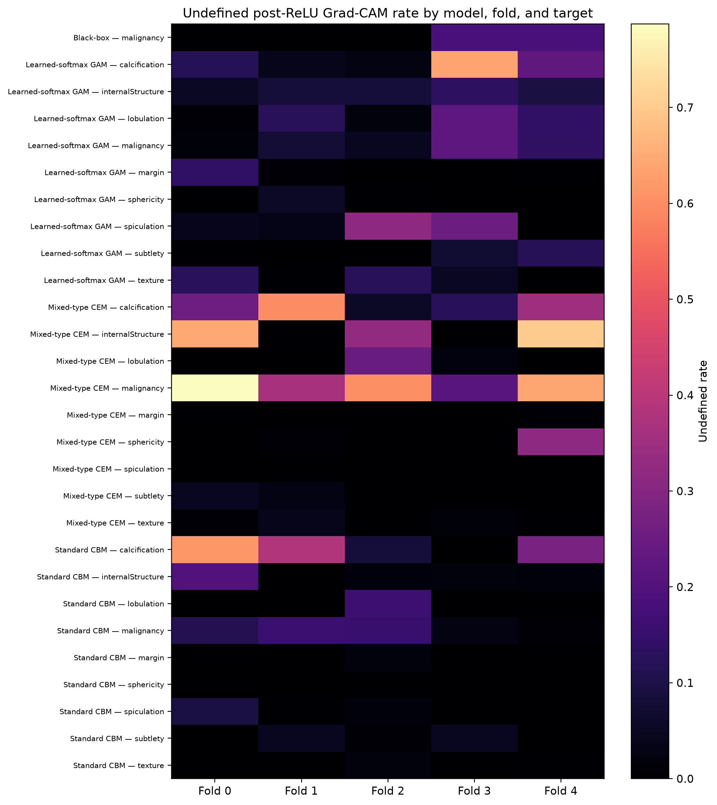

**RPT-F07.** Undefined post-ReLU Grad-CAM rate by model, fold, and target.

What does this mean? Grad-CAM provides a spatial sensitivity proxy, not a ground-truth localisation claim. The zero-map concentration and weak matched-random advantage limit strong spatial interpretations even when the underlying task prediction is accurate. Display overlays are normalized only for qualitative reading; every quantitative occlusion result uses the original unnormalized FP32 map.

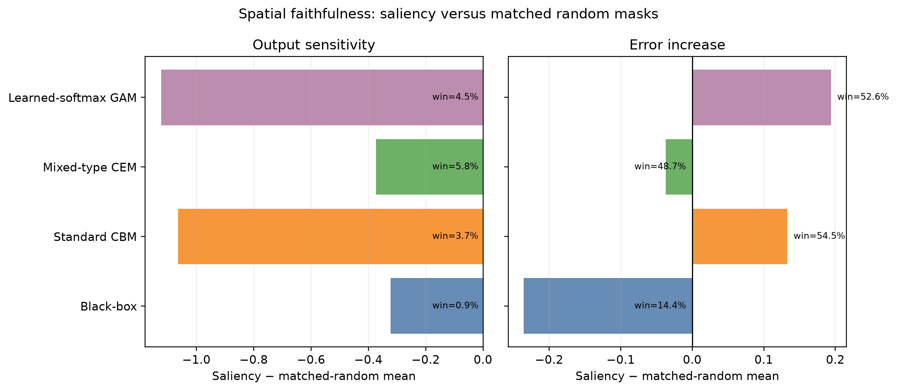

**RPT-F08.** All-target model-pooled spatial faithfulness for output_sensitivity and error_increase versus matched random masks.

### 6.3 Results — WHAT

What was measured? Continuous concept fidelity uses MAE, RMSE, Pearson, and Spearman over 2,633 nodules for each concept model. Categorical fidelity uses soft cross-entropy and multiclass Brier on the full reader-vote distributions, plus hard modal macro-F1 only where the true modal class is unique. Table RPT-T11 and Figure RPT-F09A keep continuous metrics on compatible scales; Table RPT-T12 and Figure RPT-F09B do the same for categorical evidence.

**RPT-T11. Continuous concept metrics**

| Model | Concept | MAE | RMSE | Pearson | Spearman | N |
| --- | --- | --- | --- | --- | --- | --- |
| Learned-softmax GAM | lobulation | 0.127 | 0.190 | 0.451 | 0.472 | 2633 |
| Learned-softmax GAM | margin | 0.145 | 0.198 | 0.683 | 0.648 | 2633 |
| Learned-softmax GAM | sphericity | 0.140 | 0.178 | 0.424 | 0.435 | 2633 |
| Learned-softmax GAM | spiculation | 0.114 | 0.184 | 0.499 | 0.456 | 2633 |
| Learned-softmax GAM | subtlety | 0.168 | 0.221 | 0.578 | 0.582 | 2633 |
| Learned-softmax GAM | texture | 0.111 | 0.179 | 0.786 | 0.583 | 2633 |
| Mixed-type CEM | lobulation | 0.183 | 0.218 | 0.270 | 0.249 | 2633 |
| Mixed-type CEM | margin | 0.246 | 0.292 | 0.188 | 0.171 | 2633 |
| Mixed-type CEM | sphericity | 0.178 | 0.217 | 0.056 | 0.051 | 2633 |
| Mixed-type CEM | spiculation | 0.180 | 0.216 | 0.305 | 0.274 | 2633 |
| Mixed-type CEM | subtlety | 0.204 | 0.250 | 0.445 | 0.449 | 2633 |
| Mixed-type CEM | texture | 0.265 | 0.305 | 0.202 | 0.167 | 2633 |
| Standard CBM | lobulation | 0.131 | 0.186 | 0.460 | 0.456 | 2633 |
| Standard CBM | margin | 0.146 | 0.197 | 0.687 | 0.647 | 2633 |
| Standard CBM | sphericity | 0.139 | 0.177 | 0.437 | 0.453 | 2633 |
| Standard CBM | spiculation | 0.121 | 0.182 | 0.507 | 0.416 | 2633 |
| Standard CBM | subtlety | 0.169 | 0.223 | 0.567 | 0.573 | 2633 |
| Standard CBM | texture | 0.116 | 0.180 | 0.783 | 0.581 | 2633 |

What did we observe? Continuous fidelity differed substantially by concept and model rather than following a single model-wide pattern. Some morphological concepts showed useful correlation, while subtle or reader-variable concepts retained larger absolute errors. This heterogeneity matters because the downstream concept models can only explain their own predicted representations, not an error-free radiological state.

**RPT-T12. Categorical concept metrics**

| Model | Concept | Soft CE | Brier | Macro-F1 | Soft N | Hard N | Ties |
| --- | --- | --- | --- | --- | --- | --- | --- |
| Learned-softmax GAM | calcification | 0.201 | 0.048 | 0.313 | 2633 | 2578 | 55 |
| Learned-softmax GAM | internalStructure | 0.038 | 0.007 | 0.312 | 2633 | 2625 | 8 |
| Mixed-type CEM | calcification | 0.262 | 0.068 | 0.310 | 2633 | 2578 | 55 |
| Mixed-type CEM | internalStructure | 0.083 | 0.014 | 0.250 | 2633 | 2625 | 8 |
| Standard CBM | calcification | 0.207 | 0.049 | 0.314 | 2633 | 2578 | 55 |
| Standard CBM | internalStructure | 0.039 | 0.007 | 0.250 | 2633 | 2625 | 8 |

Categorical results were more limited. internalStructure and calcification retain complete vote distributions, so soft losses and Brier scores are the authoritative distributional evidence. Hard modal macro-F1 is included for readability but excludes true ties and can be low when rare classes are difficult. Treating the modal label as a single expert ground truth would misstate the frozen target.

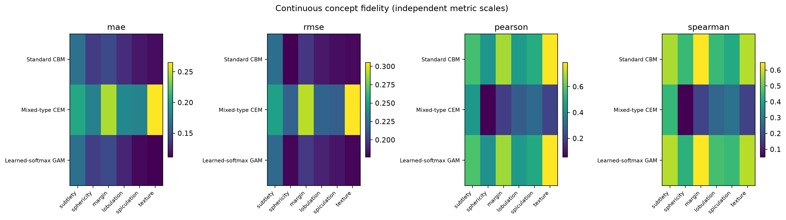

**RPT-F09A.** Continuous concept fidelity on independent metric scales.

What does this mean? WHAT evidence supports inspecting individual concept groups rather than declaring that a model has uniformly learned radiological concepts. Concept fidelity is necessary for a transparent bottleneck but is not sufficient for predictive superiority or intervention benefit. The private RPT-TA02 table therefore presents both continuous targets and categorical vote-distribution semantics at case level.

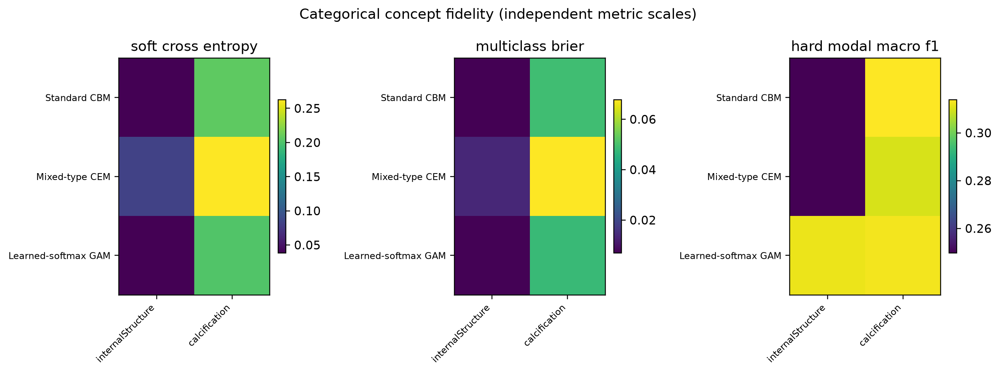

**RPT-F09B.** Categorical concept fidelity on independent metric scales.

### 6.4 Results — WHY

What was measured? WHY evidence asks how predicted concepts enter each concept model's malignancy score. For every fold, train-only means centre the raw group terms, and the centered bias plus eight terms reconstructs the task score within the frozen 1e-6 tolerance. Table RPT-T15 summarizes selected persisted pooled signed means; complete fold-level centering constants remain in the reproducibility evidence.

**RPT-T15. Centered contribution summary**

| Model | Concept | Pooled signed mean (rating points) | Role within model |
| --- | --- | --- | --- |
| Standard CBM | calcification | 0.400 | Largest pooled signed mean |
| Standard CBM | texture | -0.122 | Smallest pooled signed mean |
| Mixed-type CEM | internalStructure | 0.486 | Largest pooled signed mean |
| Mixed-type CEM | texture | 0.101 | Smallest pooled signed mean |
| Learned-softmax GAM | calcification | 0.402 | Largest pooled signed mean |
| Learned-softmax GAM | lobulation | -0.016 | Smallest pooled signed mean |

What did we observe? Signed contribution directions differ across concept and model, demonstrating that identical concept names need not play identical decision roles. Figure RPT-F10 displays empirical OOF profiles derived as a presentation summary of frozen per-sample points. The profiles are descriptive and should not be read as global causal shape functions. The authoritative model-by-concept mean absolute aggregate was not persisted, so the report marks it DATA_NOT_PERSISTED rather than recreating it.

**RPT-T16. Fold-level Learned-softmax GAM alpha**

| Fold | Concept | Expert 1 | Expert 2 | Expert 3 | Expert 4 | Expert 5 | Min–max | Simplex |
| --- | --- | --- | --- | --- | --- | --- | --- | --- |
| 0 | calcification | 0.200 | 0.200 | 0.204 | 0.196 | 0.199 | 0.196–0.204 | 1.000 |
| 0 | internalStructure | 0.200 | 0.200 | 0.200 | 0.200 | 0.200 | 0.200–0.200 | 1.000 |
| 0 | lobulation | 0.201 | 0.203 | 0.198 | 0.200 | 0.197 | 0.197–0.203 | 1.000 |
| 0 | margin | 0.198 | 0.198 | 0.203 | 0.202 | 0.200 | 0.198–0.203 | 1.000 |
| 0 | sphericity | 0.199 | 0.200 | 0.200 | 0.202 | 0.200 | 0.199–0.202 | 1.000 |
| 0 | spiculation | 0.194 | 0.200 | 0.200 | 0.200 | 0.207 | 0.194–0.207 | 1.000 |
| 0 | subtlety | 0.206 | 0.195 | 0.198 | 0.202 | 0.198 | 0.195–0.206 | 1.000 |
| 0 | texture | 0.201 | 0.200 | 0.199 | 0.200 | 0.200 | 0.199–0.201 | 1.000 |
| 1 | calcification | 0.195 | 0.191 | 0.201 | 0.201 | 0.211 | 0.191–0.211 | 1.000 |
| 1 | internalStructure | 0.201 | 0.199 | 0.199 | 0.199 | 0.201 | 0.199–0.201 | 1.000 |
| 1 | lobulation | 0.197 | 0.199 | 0.203 | 0.206 | 0.195 | 0.195–0.206 | 1.000 |
| 1 | margin | 0.202 | 0.200 | 0.199 | 0.199 | 0.201 | 0.199–0.202 | 1.000 |
| 1 | sphericity | 0.199 | 0.199 | 0.201 | 0.199 | 0.202 | 0.199–0.202 | 1.000 |
| 1 | spiculation | 0.200 | 0.203 | 0.205 | 0.195 | 0.197 | 0.195–0.205 | 1.000 |
| 1 | subtlety | 0.203 | 0.200 | 0.196 | 0.201 | 0.200 | 0.196–0.203 | 1.000 |
| 1 | texture | 0.202 | 0.200 | 0.199 | 0.198 | 0.201 | 0.198–0.202 | 1.000 |
| 2 | calcification | 0.200 | 0.196 | 0.206 | 0.199 | 0.199 | 0.196–0.206 | 1.000 |
| 2 | internalStructure | 0.199 | 0.199 | 0.201 | 0.201 | 0.201 | 0.199–0.201 | 1.000 |
| 2 | lobulation | 0.196 | 0.202 | 0.206 | 0.192 | 0.204 | 0.192–0.206 | 1.000 |
| 2 | margin | 0.201 | 0.199 | 0.198 | 0.200 | 0.202 | 0.198–0.202 | 1.000 |
| 2 | sphericity | 0.200 | 0.202 | 0.199 | 0.199 | 0.201 | 0.199–0.202 | 1.000 |
| 2 | spiculation | 0.207 | 0.201 | 0.202 | 0.196 | 0.193 | 0.193–0.207 | 1.000 |
| 2 | subtlety | 0.198 | 0.201 | 0.202 | 0.198 | 0.201 | 0.198–0.202 | 1.000 |
| 2 | texture | 0.201 | 0.199 | 0.199 | 0.199 | 0.201 | 0.199–0.201 | 1.000 |
| 3 | calcification | 0.198 | 0.203 | 0.200 | 0.196 | 0.202 | 0.196–0.203 | 1.000 |
| 3 | internalStructure | 0.201 | 0.200 | 0.199 | 0.199 | 0.201 | 0.199–0.201 | 1.000 |
| 3 | lobulation | 0.195 | 0.214 | 0.195 | 0.197 | 0.200 | 0.195–0.214 | 1.000 |
| 3 | margin | 0.200 | 0.203 | 0.199 | 0.200 | 0.198 | 0.198–0.203 | 1.000 |
| 3 | sphericity | 0.201 | 0.199 | 0.200 | 0.201 | 0.198 | 0.198–0.201 | 1.000 |
| 3 | spiculation | 0.203 | 0.203 | 0.192 | 0.200 | 0.201 | 0.192–0.203 | 1.000 |
| 3 | subtlety | 0.198 | 0.202 | 0.200 | 0.199 | 0.201 | 0.198–0.202 | 1.000 |
| 3 | texture | 0.200 | 0.199 | 0.200 | 0.201 | 0.199 | 0.199–0.201 | 1.000 |
| 4 | calcification | 0.203 | 0.206 | 0.195 | 0.193 | 0.202 | 0.193–0.206 | 1.000 |
| 4 | internalStructure | 0.200 | 0.201 | 0.199 | 0.201 | 0.199 | 0.199–0.201 | 1.000 |
| 4 | lobulation | 0.190 | 0.203 | 0.204 | 0.206 | 0.198 | 0.190–0.206 | 1.000 |
| 4 | margin | 0.201 | 0.200 | 0.199 | 0.200 | 0.201 | 0.199–0.201 | 1.000 |
| 4 | sphericity | 0.199 | 0.199 | 0.202 | 0.199 | 0.201 | 0.199–0.202 | 1.000 |
| 4 | spiculation | 0.198 | 0.201 | 0.198 | 0.203 | 0.199 | 0.198–0.203 | 1.000 |
| 4 | subtlety | 0.196 | 0.200 | 0.200 | 0.203 | 0.201 | 0.196–0.203 | 1.000 |
| 4 | texture | 0.199 | 0.199 | 0.200 | 0.202 | 0.200 | 0.199–0.202 | 1.000 |

Learned-softmax GAM adds a second WHY layer: five expert outputs per concept are mixed with nonnegative weights summing to one. Table RPT-T16 and Figure RPT-F11 show that the weights moved away from the uniform 0.2 initialization, although many movements are modest and fold-dependent. Learned mixtures therefore constitute evidence of optimisation, not proof that each expert represents a distinct clinical mechanism.

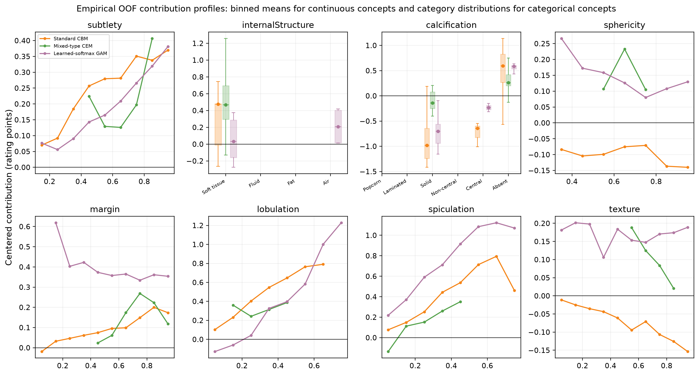

**RPT-F10.** Empirical OOF contribution profiles: continuous binned means and categorical contribution distributions; descriptive, not causal.

What does this mean? Contribution decompositions make score construction auditable and permit case-level signed bars, but magnitude and sign remain properties of the trained decision function. They do not validate the underlying concepts or establish clinical causation. The private qualitative appendix pairs contribution bars with CT context and concept prediction/target evidence so WHY is not detached from WHAT and Prediction.

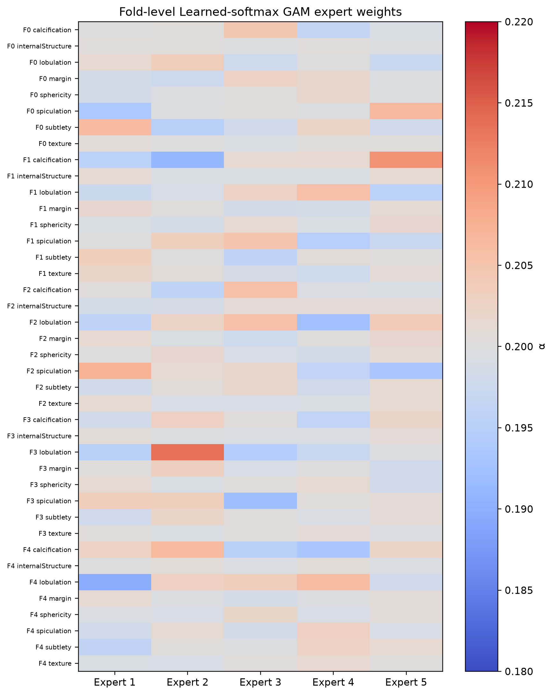

**RPT-F11.** Fold-level Learned-softmax GAM expert mixture weights.

### 6.5 Results — HOW

What was measured? Concept interventions replace 0…8 groups using the registered model-specific semantics. At every k, five-fold OOF predictions are pooled before calculating primary MAE and secondary AUROC. Random-permutation curves average 100 deterministic permutations per fold; error-first ordering ranks continuous absolute error or categorical total-variation distance without using the malignancy target.

**RPT-T17. Concept-intervention summary**

| Model | Ordering | Baseline MAE | k=4 MAE | k=8 MAE | iMAE | Delta_iMAE | Baseline AUROC | iAUC | Delta_iAUC |
| --- | --- | --- | --- | --- | --- | --- | --- | --- | --- |
| Learned-softmax GAM | error_first | 0.480 | 0.505 | 0.507 | 0.497 | -0.016 | 0.949 | 0.932 | -0.017 |
| Learned-softmax GAM | random_permutation | 0.480 | 0.479 | 0.507 | 0.484 | -0.003 | 0.949 | 0.943 | -0.006 |
| Mixed-type CEM | error_first | 0.484 | 0.440 | 0.436 | 0.445 | 0.040 | 0.942 | 0.960 | 0.018 |
| Mixed-type CEM | random_permutation | 0.484 | 0.454 | 0.436 | 0.456 | 0.028 | 0.942 | 0.954 | 0.013 |
| Standard CBM | error_first | 0.502 | 0.510 | 0.508 | 0.506 | -0.004 | 0.933 | 0.922 | -0.011 |
| Standard CBM | random_permutation | 0.502 | 0.500 | 0.508 | 0.501 | 0.001 | 0.933 | 0.929 | -0.004 |

What did we observe? Mixed-type CEM uniquely showed strong, consistent integrated MAE benefit: Delta_iMAE was +0.028 under random permutations and +0.040 under error-first ordering. Standard CBM was approximately neutral under random ordering (+0.001) and slightly unfavorable under error-first ordering (−0.004). Learned-softmax GAM showed limited early gains along parts of the k curve, but its integrated Delta_iMAE was negative overall (−0.003 random; −0.016 error-first). Table RPT-T17 retains baseline, intermediate, k=8, iMAE, Delta_iMAE, iAUC, and Delta_iAUC; Figure RPT-F12 displays all k=0…8 curves.

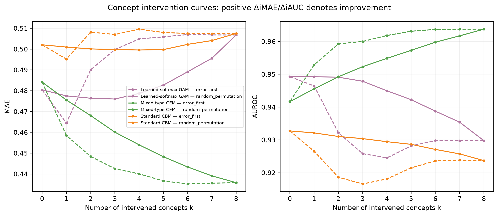

**RPT-F12.** k=0…8 concept-intervention curves under random and error-first orderings.

Error-first results were not uniformly better than random ordering. Correcting the currently worst-predicted concept first can expose compensating errors elsewhere in the model, and later interventions may reverse an early benefit. This is an important negative result because it shows that concept correction is not a monotonic repair operation.

What does this mean? Concept fidelity and intervenability are not interchangeable. GAM can predict concepts comparatively well yet respond unfavorably when their integrated substitutions are propagated; CEM can have weaker concept fidelity in places while benefiting most from correction. HOW evidence tests dependence on internal concept representations, not the causal effect of changing patient radiology. Case-level before/after values were not persisted for RPT-FA06, so HOW remains DATA_NOT_PERSISTED rather than being recomputed.

### 6.6 Integrated Interpretation

Prediction, WHERE, WHAT, WHY, and HOW answer different questions and should not be collapsed into a single explainability score. Prediction establishes task performance. WHERE tests spatial sensitivity but is limited by zero maps and weak matched-random advantages. WHAT measures whether named concepts match reader evidence. WHY exposes score composition. HOW probes whether correcting representations changes the output.

**RPT-T18. WHERE-WHAT-WHY-HOW synthesis**

| Layer | Question | Main evidence | Boundary |
| --- | --- | --- | --- |
| Prediction | How accurately is malignancy scored? | Learned-softmax GAM has the lowest point-estimate MAE; paired support is model-dependent. | Radiologist assessment, not pathology. |
| WHERE | Where is the output spatially sensitive? | 66,769 valid maps; saliency often did not exceed matched random masks. | 6,955 post-ReLU zero maps; exact mechanism unavailable. |
| WHAT | Which concepts were predicted? | Continuous fidelity varied by concept; categorical hard-F1 was limited. | Categorical targets are reader-vote distributions. |
| WHY | How do concepts enter the score? | Signed centered terms and learned GAM mixtures reconstruct the score. | Centering constants are not importance; mean absolute aggregate was not persisted. |
| HOW | How does correcting concepts alter prediction? | Benefit was strong and consistent for CEM, near-neutral for CBM, and unfavorable overall for GAM despite limited early gains. | Concept fidelity and intervenability are not interchangeable; interventions are not causal clinical effects. |

The strongest integrated interpretation belongs to a model only when these layers are read together. Learned-softmax GAM has the best primary point estimate and strong concept fidelity in several groups, yet its integrated intervention response is unfavorable overall. Mixed-type CEM performs better than Black-box and Standard CBM on primary MAE and benefits most consistently from intervention despite weaker concept fidelity in places. Standard CBM remains simple and traceable but gains little task or intervention advantage.

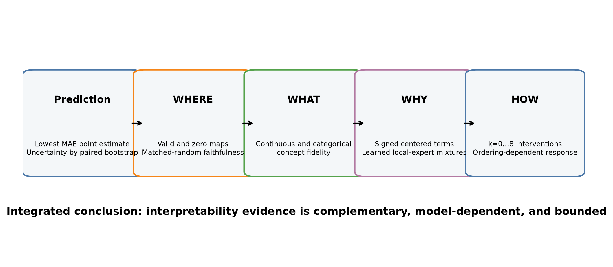

**RPT-F13.** Integrated Prediction-WHERE-WHAT-WHY-HOW interpretation and its boundaries.

Table RPT-T18 and Figure RPT-F13 therefore present a chain of supported claims and boundaries rather than a winner-takes-all dashboard. The conclusion is that interpretability is multidimensional and model-dependent: a useful explanation must specify which layer it supports, what frozen evidence underlies it, and what it cannot establish.

## 7. Discussion

The primary result favours Learned-softmax GAM at the point-estimate level, and paired MAE comparisons support meaningful improvement over Black-box and Standard CBM. This suggests that explicit concept-local nonlinearities can improve continuous scoring while preserving additive decomposition. However, confidence intervals and secondary discrimination prevent an overly simple ranking: the best regression point estimate is not synonymous with statistically superior AUROC across every pair.

The explanation layers reveal trade-offs that prediction metrics alone cannot show. GAM combines the best task point estimate with strong concept fidelity in several groups, but its integrated intervention response is negative overall. CEM has a better task estimate than Black-box and Standard CBM and the strongest correction response despite weaker concept fidelity in places. Standard CBM is transparent and sometimes concept-faithful, yet offers little task or intervention advantage. Prediction, concept fidelity, intervenability, and spatial faithfulness are therefore distinct properties, not interchangeable definitions of interpretability.

Spatial evidence is the clearest caution. Thousands of legitimate post-ReLU zero maps and predominantly weak saliency-versus-random differences mean that visually appealing overlays should not dominate the scientific story. A Grad-CAM overlay is best treated as a local sensitivity view whose credibility is strengthened only when quantitative faithfulness and map-validity accounting agree.

Clinically, the framework offers a disciplined way to communicate model behaviour, not a diagnosis. Reader ratings encode radiological assessment and disagreement; they do not establish histopathological truth. External validation, calibration for deployment, prospective workflow testing, and pathology-linked outcomes would be required before any clinical claim.

Model selection therefore depends on the intended scientific use. Choosing only the lowest MAE would favour GAM, whereas choosing only intervention response would favour CEM, and choosing only architectural simplicity might favour Standard CBM. The evidence does not justify collapsing these criteria into a post hoc composite rank. Predictive benchmarking, inspection of concept errors, decomposition of score formation, and controlled testing of representation dependence are related but distinct goals.

The negative results are informative rather than incidental. The mismatch between concept fidelity and intervention benefit shows why a well-predicted bottleneck is not necessarily a useful correction interface. Weak or negative matched-random spatial contrasts show why heatmaps require quantitative checks. Concentrated undefined maps show why missing spatial explanations must be counted rather than silently discarded. These findings narrow the claims but make the resulting interpretation more reproducible.

## 8. Limitations

First, the target is a radiologist-assessed malignancy score rather than pathology-confirmed disease. The patient-grouped internal cross-validation design controls leakage but cannot establish transportability to another institution, scanner distribution, or clinical workflow. Only one preregistered seed per fold was used, so the reported bootstrap intervals describe patient-sampling uncertainty rather than training-seed variability.

Second, concept ground truth inherits reader variability. Continuous means compress disagreement, and categorical vote distributions can be sparse. Hard modal macro-F1 excludes true ties and is secondary to the full distributional metrics. Concept interventions replace internal representations with reader-derived targets; they should not be interpreted as feasible clinical manipulations or causal effects.

Third, Grad-CAM is a nodule-level spatial proxy. The 6,955 undefined maps are confirmed finite post-ReLU all-zero maps, but the exact pre-ReLU/gradient mechanism was not persisted. The observed concentration is therefore reported as SYSTEMATIC_MODEL/TARGET_ISSUE, not resolved into zero gradients, zero channel weights, or negative weighted sums without prohibited new forward passes.

Finally, some presentation goals are constrained by what was frozen. The model-by-concept mean absolute centered contribution aggregate and case-level intervention before/after trajectory were not persisted. The contribution table therefore reports supported signed means only and notes this limitation once; the report does not convert descriptive plotting or narrative memory into a new authoritative scientific result.

## 9. Conclusion

This unified comparison shows that prediction and explanation should be evaluated as a chain of distinct questions. Learned-softmax GAM achieved the lowest primary MAE point estimate, while paired uncertainty showed where this advantage was and was not decisive. Concept models added inspectable representations, signed score decompositions, and intervention experiments that a Black-box predictor cannot provide.

The explanation evidence also imposed meaningful limits. CEM alone showed strong and consistent integrated intervention benefit; CBM was near-neutral and GAM was unfavorable overall despite limited early gains. Concept fidelity therefore did not predict intervenability. Grad-CAM maps could also be undefined, and saliency masks often failed to outperform matched random masks. These findings determine how strongly each explanation can be interpreted.

The resulting framework supports transparent research reporting of radiologist-assessed pulmonary-nodule malignancy. It does not establish pathology-level diagnosis, causal concepts, ground-truth localisation, or clinical readiness. Its central contribution is a reproducible evidence structure linking Prediction, WHERE, WHAT, WHY, and HOW while keeping each claim bound to its frozen source and interpretation boundary.

## Public Reproducibility Appendix

All scientific values are read from the user-approved 2,395-item Results Catalogue and its registered frozen sources. The report-revision supplement binds the Catalogue registry SHA, Catalogue manifest SHA, and both approved planning-document SHAs. Section manifests and reverse-traceability rows connect every rendered table, figure, caption, and conclusion code to Catalogue item IDs and source hashes.

P5–P9 checkpoints, histories, predictions, metrics, evaluations, OOF rows, interventions, Grad-CAM maps, occlusion rows, and faithfulness payloads remain read-only. Report generation performs no training, model forward pass, test inference, bootstrap recomputation, or new scientific job. The private archive remains outside Git and stores full-resolution case assets under opaque CASE labels.

The archive contains 1,698 files and 14,386,651,621 bytes under a completed SHA-verified manifest. The six mandatory PDFs are rendered page by page with Poppler at 150 DPI, inspected through contact sheets and original-resolution pages, and checked with pypdf/pdfplumber for metadata, text, numbering, fonts, and page integrity before P10 can enter AWAITING_USER_APPROVAL.

## References

[1] S. G. Armato III et al., "The Lung Image Database Consortium (LIDC) and Image Database Resource Initiative (IDRI): A completed reference database of lung nodules on CT scans," Med. Phys., vol. 38, no. 2, pp. 915–931, 2011, doi: 10.1118/1.3528204.

[2] G. Huang, Z. Liu, L. van der Maaten, and K. Q. Weinberger, "Densely Connected Convolutional Networks," in Proc. IEEE Conf. Comput. Vis. Pattern Recognit. (CVPR), pp. 4700–4708, 2017, doi: 10.1109/CVPR.2017.243.

[3] P. W. Koh et al., "Concept Bottleneck Models," in Proc. 37th Int. Conf. Mach. Learn. (ICML), PMLR, vol. 119, pp. 5338–5348, 2020.

[4] M. Espinosa Zarlenga et al., "Concept Embedding Models: Beyond the Accuracy–Explainability Trade-Off," in Adv. Neural Inf. Process. Syst., vol. 35, pp. 21400–21413, 2022.

[5] T. Hastie and R. Tibshirani, "Generalized Additive Models," Stat. Sci., vol. 1, no. 3, pp. 297–318, 1986, doi: 10.1214/ss/1177013604.

[6] R. R. Selvaraju et al., "Grad-CAM: Visual Explanations from Deep Networks via Gradient-Based Localization," in Proc. IEEE Int. Conf. Comput. Vis. (ICCV), pp. 618–626, 2017, doi: 10.1109/ICCV.2017.74.

[7] S. Shin, Y. Jo, S. Ahn, and N. Lee, "A Closer Look at the Intervention Procedure of Concept Bottleneck Models," in Proc. 40th Int. Conf. Mach. Learn. (ICML), PMLR, vol. 202, pp. 31504–31520, 2023.

[8] R. I. Dumaev, S. A. Molodyakov, and L. V. Utkin, "Concept-based Explainable Malignancy Scoring on Pulmonary Nodules in CT Images," arXiv:2405.17483, 2024, doi: 10.48550/arXiv.2405.17483.

[9] W. Shen et al., "Multi-crop Convolutional Neural Networks for Lung Nodule Malignancy Suspiciousness Classification," Pattern Recognit., vol. 61, pp. 663–673, 2017, doi: 10.1016/j.patcog.2016.05.029.

[10] B. Efron, "Bootstrap Methods: Another Look at the Jackknife," Ann. Stat., vol. 7, no. 1, pp. 1–26, 1979, doi: 10.1214/aos/1176344552.
