# 可解释肺结节恶性评分：Prediction、WHERE、WHAT、WHY 与 HOW

**作者:** [To be completed]

**单位:** [To be completed]

**导师:** [To be completed]

**日期:** 2026-08-13

**关键词:** LIDC-IDRI; concept bottleneck; Grad-CAM; intervention; explainability

## 摘要

本研究在冻结的 2,633 个结节、868 名患者队列上，比较四种用于放射科医师评估肺结节恶性程度的三维深度学习策略。主要终点是在原始 1–5 评分量尺上的 pooled OOF 平均绝对误差；次要证据包括 1,073 个极端结节、八个瓶颈概念、中心化评分贡献、概念干预与空间 Grad-CAM 忠实度。报告按 Prediction、WHERE、WHAT、WHY、HOW 组织，而不是按审计清单堆叠结果。

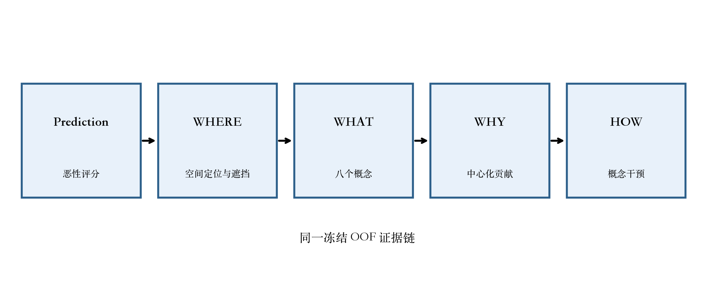

**RPT-F01.** 从预测串联 WHERE、WHAT、WHY 与 HOW 的端到端证据框架。

Learned-softmax GAM 的主要 MAE 点估计最低，为 0.480；Black-box 为 0.501。四个模型共请求 73,724 个 Grad-CAM 目标，其中 66,769 个有效，6,955 个被明确记录为 post-ReLU 全零图。匹配随机遮挡表明，空间显著性并非始终比随机遮挡更忠实；概念干预的变化则依赖模型与排序方式。

这些结果支持分层解释：较好的预测本身不能证明空间或概念忠实度；概念预测较准也不保证干预有益；加性贡献分解能够描述模型评分，但不建立临床因果关系。恶性程度是放射科医师评估，并非病理确诊；本系统不是临床诊断产品。

## 1. 引言

肺结节恶性程度评估同时包含预测问题与解释问题。数值恶性评分可用于基准比较，但读者还需要知道图像的哪些位置影响模型、模型表示了哪些影像学概念、这些表示为何改变输出，以及在纠正概念信息时输出如何变化。若把这些证据视为同一种“解释”，就会掩盖它们不同的证据角色。

因此，本研究围绕五个相互连接的问题组织分析。Prediction 关注连续的放射科医师评估目标能否被准确估计；WHERE 使用 Grad-CAM 与匹配遮挡评估空间敏感性；WHAT 衡量六个连续概念和两个分类概念的预测忠实度；WHY 把概念模型评分分解为仅由训练折统计量中心化的有符号贡献与学习到的局部专家混合；HOW 通过预注册概念干预测试模型依赖。

本研究不是新的临床分类器，也不声称达到病理诊断层级。它在相同患者分组折、共享编码器初始化、test exactly-once 和统一 OOF 分析下，比较 Black-box、Standard CBM、项目特定 Mixed-type CEM 与预注册 Learned-softmax GAM。报告保留负面结果，包括不确定的配对 AUROC 差异、有限的分类概念忠实度、依赖模型的干预收益，以及集中的全零图现象。

## 2. 相关工作

LIDC-IDRI 提供带有多读者结节标注的公开胸部 CT 参考数据库 [1]。既往肺结节系统使用局部图像 patch 与卷积网络预测恶性可疑度；例如 MC-CNN 把多尺度图像特征与可疑度及部分语义属性联系起来 [9]。这些研究支持体积图像建模，也强化本研究保留的关键边界：LIDC malignancy 是读者评估，不是病理确诊。

**RPT-T01. 相关工作比较**

| Approach | Prediction | Concepts | Spatial explanation | Intervention | This study |
| --- | --- | --- | --- | --- | --- |
| Black-box CNN | Yes | No | Optional | No | Comparator |
| Concept Bottleneck Model | Yes | Explicit | Concept/task Grad-CAM | Concept replacement | Standard CBM |
| Concept Embedding Model | Yes | Mixed-type embeddings | Concept/task Grad-CAM | Mixture-weight replacement | Project-specific Mixed-type CEM |
| Additive local experts | Yes | Explicit | Concept/task Grad-CAM | Local-expert re-evaluation | Preregistered Learned-softmax GAM |

DenseNet 改善特征复用与梯度流 [2]，因此四个模型采用共同的 DenseNet-121 编码器。概念瓶颈模型让中间变量可直接检查和纠正 [3]；概念嵌入模型用样本条件化表示替代标量瓶颈，并展示不同的准确度–干预 trade-off [4]。本研究的 Mixed-type CEM 是针对六个连续目标和两个分类投票分布目标的项目特定扩展，并不声称原样复现原始 CEM。

广义加性模型把输出表示为分量函数之和 [5]。Dumaev 等人把概念学习和加性决策解释用于 LIDC-IDRI 肺结节恶性评分 [8]，是最接近本研究任务的先例。本研究预注册的 Learned-softmax GAM 有实质差异：每个概念组包含五个局部神经专家，由逐折学习的 softmax 权重混合，并在当前冻结的患者分组协议下训练和评估。

Grad-CAM 使用卷积层的目标梯度生成粗粒度空间敏感图 [6]，但视觉集中的 map 并不自动代表忠实。本研究因此把确定性显著遮挡与 20 个等大小随机遮挡比较，并把 output_sensitivity 与 error_increase 分开保存。概念干预同样不保证改善；后续研究显示其效果强烈依赖选择策略与粒度 [7]。表 RPT-T01 对这些方法定位，但不把既往结果当作本队列证据。

这些模型家族暴露的对象不同。标量 CBM 暴露概念预测值，CEM 暴露样本条件化概念状态，加性模型暴露评分分量，Grad-CAM 则暴露依赖目标的空间敏感性。这些对象都不自动成为 ground-truth explanation。概念可以预测得准却被脆弱地使用，贡献可以重建评分却仍不具备临床因果性，空间图也可能视觉合理而无法通过遮挡比较。因此本研究把这些 claim 分开，不把透明性当成单一二值属性。

肺结节研究在队列身份、标签构建、split unit 与报告量尺上也存在差异。当既往工作使用不同的实体结节 reconciliation、二分可疑度目标或图像抽样协议时，直接比较数值并不安全。因此既往工作只用于方法动机与解读边界；所有性能 claim 只来自冻结的 2,633 结节 Baseline-v2 分析。这对相近的 Dumaev 研究 [8] 尤其重要：其已发表队列统计不会进入本研究的 cohort flow。

## 3. 数据集与预处理

本研究使用 LIDC-IDRI XML 读者标注与稳定的实体结节身份。冻结主要队列包含 2,633 个结节、868 名患者；其中 1,073 个结节、578 名患者满足预注册极端定义，包括 782 个低分结节与 291 个高分结节。Patient Diagnoses XLS 不参与训练；恶性程度是有效放射科医师评分均值，而不是病理确诊标签。

**RPT-T02. 冻结队列流程**

| Cohort component | Nodules | Patients | Role |
| --- | --- | --- | --- |
| Primary regression | 2633 | 868 | Main five-fold evaluation |
| Secondary extreme subset | 1073 | 578 | 782 low / 291 high |

Malignancy 是下游 1–5 目标，不属于八个瓶颈概念。八个概念为 subtlety、internalStructure、calcification、sphericity、margin、lobulation、spiculation 和 texture。六个目标是连续的归一化读者均值；internalStructure 与 calcification 保留完整读者投票分布，训练与 soft metrics 中包括真实众数并列。

**RPT-T03. 目标与概念定义**

| Variable | Role | Type | Frozen target |
| --- | --- | --- | --- |
| Malignancy | Downstream target (not a concept) | Continuous | Radiologist mean, 1–5; normalized (y−1)/4 |
| subtlety | Bottleneck concept | Continuous | Normalized valid-reader mean |
| sphericity | Bottleneck concept | Continuous | Normalized valid-reader mean |
| margin | Bottleneck concept | Continuous | Normalized valid-reader mean |
| lobulation | Bottleneck concept | Continuous | Normalized valid-reader mean |
| spiculation | Bottleneck concept | Continuous | Normalized valid-reader mean |
| texture | Bottleneck concept | Continuous | Normalized valid-reader mean |
| internalStructure | Bottleneck concept | Categorical (4 classes) | Full reader vote distribution |
| calcification | Bottleneck concept | Categorical (6 classes) | Full reader vote distribution |

每个模型接收 64 × 64 × 64 的局部肺结节 ROI，该输入由 consensus mask 裁剪、立方体 padding 与确定性重采样生成。ROI 不是完整轴位 CT slice，经过裁剪与重采样后可能显得分辨率更低。只有在冻结的 series、slice、bounding box 与坐标 provenance 完整时，完整轴位 CT 才用于私有上下文可视化。图 RPT-F02 与表 RPT-T02–RPT-T03 展示本研究队列与变量。

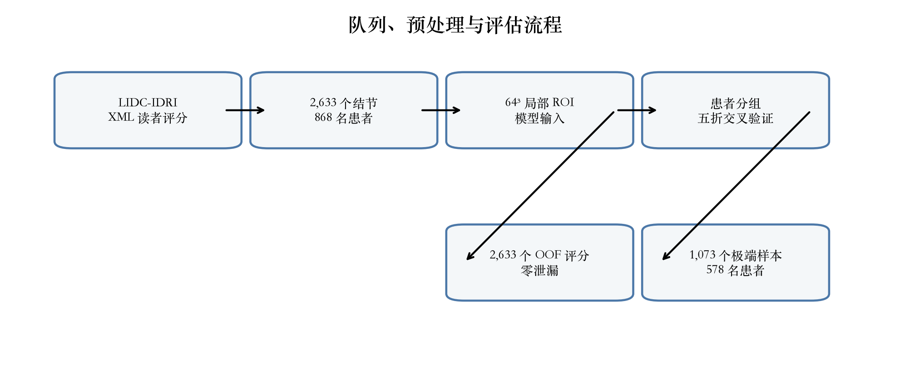

**RPT-F02.** 冻结队列、局部 ROI 预处理与患者分组五折评估流程。

## 4. 方法

四个模型共享同一逐折 DenseNet-121 编码器初始化，并使用无约束线性恶性输出。训练和评估不使用 sigmoid、tanh 或 clipping。Black-box 直接把编码器特征映射为评分；Standard CBM 先学习八个概念，再用冻结的预测概念拟合线性 task head；Mixed-type CEM 为连续与分类概念构造样本条件化状态；Learned-softmax GAM 对每个预测概念组使用五个局部专家，并相加其 softmax 加权输出。

**RPT-T04. 四模型架构比较**

| Model | Task path | Concept representation | Contribution semantics | Intervention semantics |
| --- | --- | --- | --- | --- |
| Black-box | DenseNet features → linear score | None | Not applicable | Not applicable |
| Standard CBM | Predicted concepts → linear score | 6 sigmoid + 2 softmax groups | Linear group terms | Replace activated concept group |
| Mixed-type CEM | Sample-conditioned concept embeddings → linear score | Mixed-type dynamic states | Embedding block dot product | Replace mixture weights only |
| Learned-softmax GAM | Predicted concepts → local experts → additive score | 6 sigmoid + 2 softmax groups | Softmax-weighted local experts | Ground-truth concept through experts |

概念模型贡献使用仅由当前训练折计算的均值进行中心化。中心化 bias 与八个中心化贡献重建归一化评分；把贡献乘以 4 后重建原始评分点量尺。这些有符号项描述训练模型如何组成输出；centering constants 是记账统计量，不是特征重要性。未持久化的 mean absolute aggregate 不会为展示而重算。

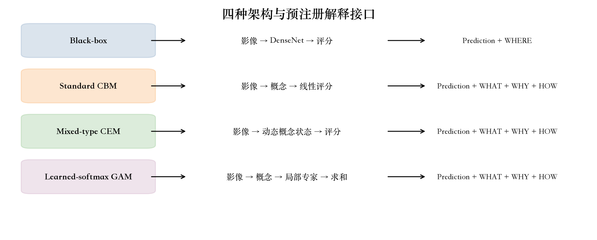

**RPT-F03.** 四种模型架构及其预注册解释接口。

Grad-CAM 使用最终预注册卷积层、空间均值梯度、加权 activation 求和、ReLU 与到 64³ 的三线性上采样。原始 FP32 map 保持为科学产物；display overlay 只允许为了可视化进行归一化。post-ReLU 全零图被标记为 undefined，并从遮挡分母中排除；冻结产物未保存 pre-ReLU、gradient norm、activation norm 或 channel-weight decomposition，因此无法推断精确机制。

遮挡把热图最高的 26,215 个 voxel 置为归一化零，并与 20 个等大小、全 ROI 均匀无放回随机遮挡比较。output_sensitivity 是输出绝对移动；error_increase 是绝对目标误差的变化，只有正值表示预测误差变大。干预曲线在共享随机 permutation 或 error-first 排序下替换 0…8 个概念组；正 Delta_iMAE 与 Delta_iAUC 始终表示改善。图 RPT-F03 与表 RPT-T04 汇总模型语义；统计协议只在 Experimental Setup 中呈现一次。

连续与分类目标需要不同的统计处理。连续属性使用 sigmoid prediction 与归一化读者均值；分类属性使用 softmax probability 与完整读者投票分布，因此用于方便展示的 modal label 不会替代科学目标。Pooled metrics 分别使用独立量尺：连续概念报告误差与相关，分类概念报告 soft cross-entropy、multiclass Brier score 与考虑并列的 hard modal macro-F1。

各架构也支持不同的 intervention semantics。Standard CBM 在线性 head 前替换 activated concept value；Mixed-type CEM 替换 mixture weight 而保留 sample-conditioned state；Learned-softmax GAM 用 ground-truth concept 重算受影响的 local expert，并保留 learned alpha。这些操作检验模型对各自 concept interface 的依赖，不会被强制同质化成数学上不同的共同干预。

## 5. 实验设置

评估采用患者分组五折 outer cross-validation，固定 test 结节数为 479、502、539、549、564。每折 partition 内患者互斥，每个主要结节在 canonical OOF test set 中恰好出现一次。逐折 validation subset 用于选择 checkpoint 和 Youden-J threshold；test labels 不参与任何选择。

**RPT-T05. 冻结训练配置**

| Setting | Frozen value |
| --- | --- |
| Input / encoder | 64³ nodule ROI / DenseNet-121 (shared fold initialization) |
| Optimizer | Adam; β=(0.9, 0.999); ε=1e-7; weight decay=0 |
| Initial learning rate / batch | 1e-4 / true micro-batch 16; no accumulation; drop_last=False |
| Epoch budget | 80 per registered stage; no early stopping |
| Scheduler | validation objective; factor 0.9 after 4 bad epochs; min_delta=1e-4; minimum LR=0 |
| Train-only augmentation | axial rotation ±15° (p=0.5); H/W flips p=0.5; z reversal p=0.5 |
| Precision / determinism | FP32; AMP/BF16/CUDA-matmul-TF32/cuDNN-TF32 off; deterministic warn-only |
| Formal accelerator | NVIDIA H200 |
| Black-box objective | MSE on unclipped normalized malignancy score |
| Standard CBM objective | 80-epoch concept loss, then 80-epoch linear task-head MSE on frozen predicted concepts |
| Mixed-type CEM objective | task MSE + 0.01 × mean eight-group concept loss |
| Learned-softmax GAM objective | task MSE + mean eight-group concept loss |

冻结训练配置采用 DenseNet-121、Adam 1e-4、真实 batch 16、80-epoch budget、仅训练期确定性 augmentation、FP32 且关闭 AMP/BF16/TF32，并使用 NVIDIA H200。模型特定 loss 结构见表 RPT-T05。固定 best checkpoint 后，test evaluation 只提交一次；逐折 best epoch 与 scheduler provenance 留在可复现性证据中，而不混入科学训练配置表。

**RPT-T06. 评估协议**

| Component | Unit | Metric | Selection/uncertainty |
| --- | --- | --- | --- |
| Primary regression | Nodule; patient-cluster bootstrap | Unclipped original-scale MAE (primary), RMSE, normalized MAE, Pearson, Spearman | 2,000 shared patient draws |
| Secondary extreme | 1,073 extreme nodules / 578 patients | AUROC, AUPRC; threshold metrics | Fold-validation extreme-only Youden-J; 2,000 valid draws |
| Concept fidelity | Nodule | Continuous MAE/RMSE/correlation; categorical CE/Brier/macro-F1 | Hard F1 excludes true modal ties |
| Spatial faithfulness | Valid Grad-CAM target | output_sensitivity and error_increase | 26,215 voxels; 20 matched random masks |
| Intervention | Pooled OOF | iMAE/Delta_iMAE; iAUC/Delta_iAUC | k=0…8; random and error-first orderings |

不确定性使用 2,000 次患者聚类 bootstrap，配对比较共享患者 draws。每个被抽中的患者携带其全部结节；若 secondary AUROC draw 只有单一类别，则重新抽样。表 RPT-T05 记录冻结训练设置；表 RPT-T06 定义评估与不确定性，并避免和 Methods 重复。

### 6.1 结果——Prediction

测量内容是什么？主要预测在全部 2,633 个 OOF 结节上评估，以原始量尺 MAE 为主要终点。Learned-softmax GAM 的点估计最低（0.480），随后为 Mixed-type CEM（0.484）、Black-box（0.501）与 Standard CBM（0.502）。表 RPT-T07 报告全部冻结回归点估计及既有 2,000-draw 区间；图 RPT-F04 直观展示不确定性重叠。

**RPT-T07. 主要回归结果**

| Model | MAE (95% CI) | RMSE (95% CI) | Normalized MAE (95% CI) | Pearson (95% CI) | Spearman (95% CI) | Prediction range (1–5) | N |
| --- | --- | --- | --- | --- | --- | --- | --- |
| Black-box | 0.501 (0.483–0.520) | 0.642 (0.619–0.667) | 0.125 (0.121–0.130) | 0.716 (0.689–0.741) | 0.635 (0.599–0.668) | 0.489–5.120 | 2633 |
| Learned-softmax GAM | 0.480 (0.462–0.498) | 0.618 (0.592–0.642) | 0.120 (0.116–0.125) | 0.741 (0.712–0.768) | 0.653 (0.616–0.688) | 1.008–4.682 | 2633 |
| Mixed-type CEM | 0.484 (0.467–0.502) | 0.628 (0.604–0.654) | 0.121 (0.117–0.126) | 0.730 (0.701–0.757) | 0.640 (0.604–0.673) | 0.823–4.935 | 2633 |
| Standard CBM | 0.502 (0.483–0.522) | 0.650 (0.625–0.675) | 0.126 (0.121–0.131) | 0.708 (0.677–0.735) | 0.609 (0.570–0.648) | 0.858–4.580 | 2633 |

观察到了什么？配对 Delta-MAE 支持 Learned-softmax GAM 优于 Black-box 和 Standard CBM，因为对应区间不跨零；较小差异则需要谨慎解读。Black-box 与 Standard CBM 的区间跨零，说明加入解释结构并不会自动改善点预测。表 RPT-T08 与图 RPT-F05 保留全部六组比较以及 MAE_A − MAE_B 符号约定。

**RPT-T08. 六组配对 Delta-MAE 比较**

| Comparison (A vs B) | Delta-MAE (A−B) | 95% CI | Crosses zero | Sign convention | Supported conclusion |
| --- | --- | --- | --- | --- | --- |
| Black-box vs Learned-softmax GAM | 0.020 | 0.010–0.031 | False | Positive Δ favors B | SUPPORTS_B |
| Black-box vs Mixed-type CEM | 0.016 | 0.006–0.027 | False | Positive Δ favors B | SUPPORTS_B |
| Black-box vs Standard CBM | -0.002 | -0.015–0.012 | True | Positive Δ favors B | NO_SUPPORTED_DIFFERENCE_CI_CROSSES_ZERO |
| Mixed-type CEM vs Learned-softmax GAM | 0.004 | -0.006–0.013 | True | Positive Δ favors B | NO_SUPPORTED_DIFFERENCE_CI_CROSSES_ZERO |
| Standard CBM vs Learned-softmax GAM | 0.022 | 0.011–0.033 | False | Positive Δ favors B | SUPPORTS_B |
| Standard CBM vs Mixed-type CEM | 0.018 | 0.006–0.030 | False | Positive Δ favors B | SUPPORTS_B |

在 1,073 个结节的极端子集上，四个连续评分均能区分低分与高分，但配对 Delta-AUROC 证据不如 MAE 证据明确。多个区间跨零；在预注册 B−A 约定下，Standard CBM 低于 Black-box。因此，表 RPT-T09、表 RPT-T10 与图 RPT-F06 把绝对 AUROC/AUPRC 性能和模型间不确定性分开。

**RPT-T09. 极端任务性能**

| Model | AUROC (95% CI) | AUPRC (95% CI) | Sensitivity | Specificity | Balanced accuracy | N |
| --- | --- | --- | --- | --- | --- | --- |
| Black-box | 0.945 (0.926–0.962) | 0.894 (0.859–0.925) | 0.801 | 0.927 | 0.864 | 1073 |
| Learned-softmax GAM | 0.949 (0.927–0.968) | 0.903 (0.868–0.934) | 0.859 | 0.894 | 0.876 | 1073 |
| Mixed-type CEM | 0.942 (0.920–0.960) | 0.877 (0.833–0.916) | 0.832 | 0.923 | 0.877 | 1073 |
| Standard CBM | 0.933 (0.911–0.951) | 0.866 (0.826–0.900) | 0.825 | 0.866 | 0.845 | 1073 |

这意味着什么？Learned-softmax GAM 是本实验中点估计最好的回归模型，但该结果不能支持跨终点的普遍排名。未裁剪评分范围与少量越界比例属于模型行为的一部分，不应被 post-hoc clipping 隐藏。目标是放射科医师均值，因此预测精度不能解释为病理层级诊断精度。

**RPT-T10. 六组配对 Delta-AUROC 比较**

| Comparison (A vs B) | Delta-AUROC (B−A) | 95% CI | Crosses zero | Sign convention | Supported conclusion |
| --- | --- | --- | --- | --- | --- |
| Black-box vs Learned-softmax GAM | 0.004 | -0.005–0.014 | True | Positive Δ favors B | NO_SUPPORTED_DIFFERENCE_CI_CROSSES_ZERO |
| Black-box vs Mixed-type CEM | -0.004 | -0.013–0.005 | True | Positive Δ favors B | NO_SUPPORTED_DIFFERENCE_CI_CROSSES_ZERO |
| Black-box vs Standard CBM | -0.013 | -0.022–-0.004 | False | Positive Δ favors B | SUPPORTS_A |
| Mixed-type CEM vs Learned-softmax GAM | 0.008 | -0.001–0.018 | True | Positive Δ favors B | NO_SUPPORTED_DIFFERENCE_CI_CROSSES_ZERO |
| Standard CBM vs Learned-softmax GAM | 0.017 | 0.006–0.027 | False | Positive Δ favors B | SUPPORTS_B |
| Standard CBM vs Mixed-type CEM | 0.009 | -0.002–0.020 | True | Positive Δ favors B | NO_SUPPORTED_DIFFERENCE_CI_CROSSES_ZERO |

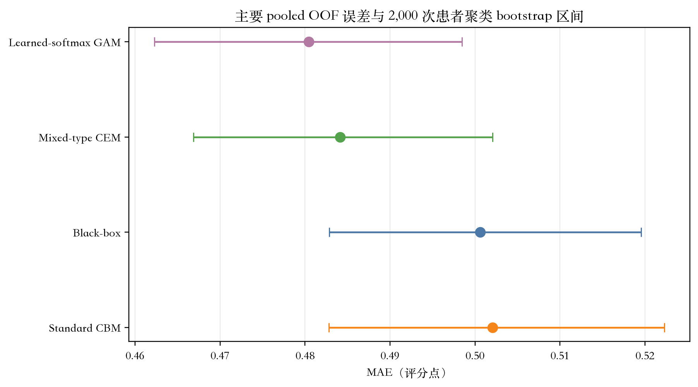

**RPT-F04.** 主要 pooled MAE 及 2,000 次患者聚类 bootstrap 95% 区间。

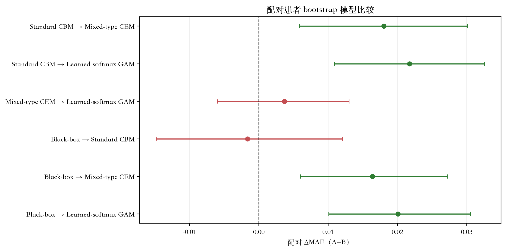

**RPT-F05.** 六组配对 Delta-MAE 比较，并区分跨零区间。

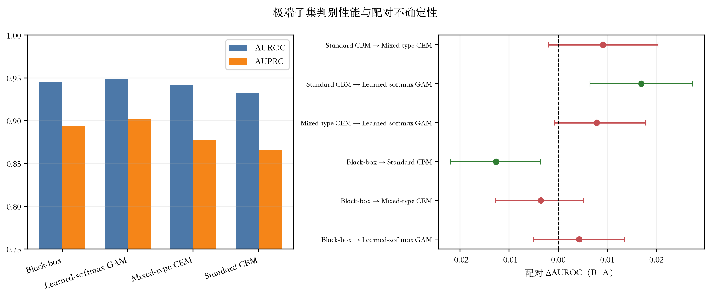

**RPT-F06.** 极端任务 AUROC/AUPRC 与六组配对 Delta-AUROC。

### 6.2 结果——WHERE

测量内容是什么？空间证据覆盖全部 model、fold、target 组合，共请求 73,724 个 Grad-CAM map。其中 66,769 个有效，6,955 个为 post-ReLU 全零图，总 undefined rate 为 9.434%。表 RPT-T13 给出完整总账；图 RPT-F07 展示 pooled count 会掩盖的集中分布。

**RPT-T13. Grad-CAM 总账**

| Model | Fold | Target | Requested | Valid | Undefined | Undefined rate |
| --- | --- | --- | --- | --- | --- | --- |
| Black-box | 0 | malignancy | 479 | 479 | 0 | 0.000 |
| Black-box | 1 | malignancy | 502 | 502 | 0 | 0.000 |
| Black-box | 2 | malignancy | 539 | 539 | 0 | 0.000 |
| Black-box | 3 | malignancy | 549 | 448 | 101 | 0.184 |
| Black-box | 4 | malignancy | 564 | 461 | 103 | 0.183 |
| Learned-softmax GAM | 0 | calcification | 479 | 422 | 57 | 0.119 |
| Learned-softmax GAM | 0 | internalStructure | 479 | 453 | 26 | 0.054 |
| Learned-softmax GAM | 0 | lobulation | 479 | 475 | 4 | 0.008 |
| Learned-softmax GAM | 0 | malignancy | 479 | 472 | 7 | 0.015 |
| Learned-softmax GAM | 0 | margin | 479 | 412 | 67 | 0.140 |
| Learned-softmax GAM | 0 | sphericity | 479 | 479 | 0 | 0.000 |
| Learned-softmax GAM | 0 | spiculation | 479 | 459 | 20 | 0.042 |
| Learned-softmax GAM | 0 | subtlety | 479 | 477 | 2 | 0.004 |
| Learned-softmax GAM | 0 | texture | 479 | 418 | 61 | 0.127 |
| Learned-softmax GAM | 1 | calcification | 502 | 482 | 20 | 0.040 |
| Learned-softmax GAM | 1 | internalStructure | 502 | 459 | 43 | 0.086 |
| Learned-softmax GAM | 1 | lobulation | 502 | 439 | 63 | 0.125 |
| Learned-softmax GAM | 1 | malignancy | 502 | 463 | 39 | 0.078 |
| Learned-softmax GAM | 1 | margin | 502 | 497 | 5 | 0.010 |
| Learned-softmax GAM | 1 | sphericity | 502 | 473 | 29 | 0.058 |
| Learned-softmax GAM | 1 | spiculation | 502 | 484 | 18 | 0.036 |
| Learned-softmax GAM | 1 | subtlety | 502 | 502 | 0 | 0.000 |
| Learned-softmax GAM | 1 | texture | 502 | 499 | 3 | 0.006 |
| Learned-softmax GAM | 2 | calcification | 539 | 525 | 14 | 0.026 |
| Learned-softmax GAM | 2 | internalStructure | 539 | 494 | 45 | 0.083 |
| Learned-softmax GAM | 2 | lobulation | 539 | 528 | 11 | 0.020 |
| Learned-softmax GAM | 2 | malignancy | 539 | 514 | 25 | 0.046 |
| Learned-softmax GAM | 2 | margin | 539 | 539 | 0 | 0.000 |
| Learned-softmax GAM | 2 | sphericity | 539 | 537 | 2 | 0.004 |
| Learned-softmax GAM | 2 | spiculation | 539 | 367 | 172 | 0.319 |
| Learned-softmax GAM | 2 | subtlety | 539 | 539 | 0 | 0.000 |
| Learned-softmax GAM | 2 | texture | 539 | 472 | 67 | 0.124 |
| Learned-softmax GAM | 3 | calcification | 549 | 198 | 351 | 0.639 |
| Learned-softmax GAM | 3 | internalStructure | 549 | 476 | 73 | 0.133 |
| Learned-softmax GAM | 3 | lobulation | 549 | 426 | 123 | 0.224 |
| Learned-softmax GAM | 3 | malignancy | 549 | 426 | 123 | 0.224 |
| Learned-softmax GAM | 3 | margin | 549 | 549 | 0 | 0.000 |
| Learned-softmax GAM | 3 | sphericity | 549 | 549 | 0 | 0.000 |
| Learned-softmax GAM | 3 | spiculation | 549 | 410 | 139 | 0.253 |
| Learned-softmax GAM | 3 | subtlety | 549 | 509 | 40 | 0.073 |
| Learned-softmax GAM | 3 | texture | 549 | 521 | 28 | 0.051 |
| Learned-softmax GAM | 4 | calcification | 564 | 435 | 129 | 0.229 |
| Learned-softmax GAM | 4 | internalStructure | 564 | 511 | 53 | 0.094 |
| Learned-softmax GAM | 4 | lobulation | 564 | 485 | 79 | 0.140 |
| Learned-softmax GAM | 4 | malignancy | 564 | 486 | 78 | 0.138 |
| Learned-softmax GAM | 4 | margin | 564 | 562 | 2 | 0.004 |
| Learned-softmax GAM | 4 | sphericity | 564 | 564 | 0 | 0.000 |
| Learned-softmax GAM | 4 | spiculation | 564 | 564 | 0 | 0.000 |
| Learned-softmax GAM | 4 | subtlety | 564 | 496 | 68 | 0.121 |
| Learned-softmax GAM | 4 | texture | 564 | 564 | 0 | 0.000 |
| Mixed-type CEM | 0 | calcification | 479 | 356 | 123 | 0.257 |
| Mixed-type CEM | 0 | internalStructure | 479 | 170 | 309 | 0.645 |
| Mixed-type CEM | 0 | lobulation | 479 | 478 | 1 | 0.002 |
| Mixed-type CEM | 0 | malignancy | 479 | 102 | 377 | 0.787 |
| Mixed-type CEM | 0 | margin | 479 | 479 | 0 | 0.000 |
| Mixed-type CEM | 0 | sphericity | 479 | 479 | 0 | 0.000 |
| Mixed-type CEM | 0 | spiculation | 479 | 479 | 0 | 0.000 |
| Mixed-type CEM | 0 | subtlety | 479 | 456 | 23 | 0.048 |
| Mixed-type CEM | 0 | texture | 479 | 475 | 4 | 0.008 |
| Mixed-type CEM | 1 | calcification | 502 | 202 | 300 | 0.598 |
| Mixed-type CEM | 1 | internalStructure | 502 | 499 | 3 | 0.006 |
| Mixed-type CEM | 1 | lobulation | 502 | 502 | 0 | 0.000 |
| Mixed-type CEM | 1 | malignancy | 502 | 318 | 184 | 0.367 |
| Mixed-type CEM | 1 | margin | 502 | 501 | 1 | 0.002 |
| Mixed-type CEM | 1 | sphericity | 502 | 497 | 5 | 0.010 |
| Mixed-type CEM | 1 | spiculation | 502 | 502 | 0 | 0.000 |
| Mixed-type CEM | 1 | subtlety | 502 | 488 | 14 | 0.028 |
| Mixed-type CEM | 1 | texture | 502 | 483 | 19 | 0.038 |
| Mixed-type CEM | 2 | calcification | 539 | 509 | 30 | 0.056 |
| Mixed-type CEM | 2 | internalStructure | 539 | 362 | 177 | 0.328 |
| Mixed-type CEM | 2 | lobulation | 539 | 405 | 134 | 0.249 |
| Mixed-type CEM | 2 | malignancy | 539 | 213 | 326 | 0.605 |
| Mixed-type CEM | 2 | margin | 539 | 539 | 0 | 0.000 |
| Mixed-type CEM | 2 | sphericity | 539 | 538 | 1 | 0.002 |
| Mixed-type CEM | 2 | spiculation | 539 | 539 | 0 | 0.000 |
| Mixed-type CEM | 2 | subtlety | 539 | 538 | 1 | 0.002 |
| Mixed-type CEM | 2 | texture | 539 | 539 | 0 | 0.000 |
| Mixed-type CEM | 3 | calcification | 549 | 481 | 68 | 0.124 |
| Mixed-type CEM | 3 | internalStructure | 549 | 549 | 0 | 0.000 |
| Mixed-type CEM | 3 | lobulation | 549 | 537 | 12 | 0.022 |
| Mixed-type CEM | 3 | malignancy | 549 | 431 | 118 | 0.215 |
| Mixed-type CEM | 3 | margin | 549 | 549 | 0 | 0.000 |
| Mixed-type CEM | 3 | sphericity | 549 | 548 | 1 | 0.002 |
| Mixed-type CEM | 3 | spiculation | 549 | 549 | 0 | 0.000 |
| Mixed-type CEM | 3 | subtlety | 549 | 549 | 0 | 0.000 |
| Mixed-type CEM | 3 | texture | 549 | 542 | 7 | 0.013 |
| Mixed-type CEM | 4 | calcification | 564 | 368 | 196 | 0.348 |
| Mixed-type CEM | 4 | internalStructure | 564 | 167 | 397 | 0.704 |
| Mixed-type CEM | 4 | lobulation | 564 | 564 | 0 | 0.000 |
| Mixed-type CEM | 4 | malignancy | 564 | 203 | 361 | 0.640 |
| Mixed-type CEM | 4 | margin | 564 | 558 | 6 | 0.011 |
| Mixed-type CEM | 4 | sphericity | 564 | 384 | 180 | 0.319 |
| Mixed-type CEM | 4 | spiculation | 564 | 564 | 0 | 0.000 |
| Mixed-type CEM | 4 | subtlety | 564 | 564 | 0 | 0.000 |
| Mixed-type CEM | 4 | texture | 564 | 561 | 3 | 0.005 |
| Standard CBM | 0 | calcification | 479 | 183 | 296 | 0.618 |
| Standard CBM | 0 | internalStructure | 479 | 382 | 97 | 0.203 |
| Standard CBM | 0 | lobulation | 479 | 479 | 0 | 0.000 |
| Standard CBM | 0 | malignancy | 479 | 424 | 55 | 0.115 |
| Standard CBM | 0 | margin | 479 | 479 | 0 | 0.000 |
| Standard CBM | 0 | sphericity | 479 | 479 | 0 | 0.000 |
| Standard CBM | 0 | spiculation | 479 | 433 | 46 | 0.096 |
| Standard CBM | 0 | subtlety | 479 | 479 | 0 | 0.000 |
| Standard CBM | 0 | texture | 479 | 479 | 0 | 0.000 |
| Standard CBM | 1 | calcification | 502 | 309 | 193 | 0.384 |
| Standard CBM | 1 | internalStructure | 502 | 501 | 1 | 0.002 |
| Standard CBM | 1 | lobulation | 502 | 502 | 0 | 0.000 |
| Standard CBM | 1 | malignancy | 502 | 423 | 79 | 0.157 |
| Standard CBM | 1 | margin | 502 | 502 | 0 | 0.000 |
| Standard CBM | 1 | sphericity | 502 | 501 | 1 | 0.002 |
| Standard CBM | 1 | spiculation | 502 | 500 | 2 | 0.004 |
| Standard CBM | 1 | subtlety | 502 | 478 | 24 | 0.048 |
| Standard CBM | 1 | texture | 502 | 502 | 0 | 0.000 |
| Standard CBM | 2 | calcification | 539 | 493 | 46 | 0.085 |
| Standard CBM | 2 | internalStructure | 539 | 530 | 9 | 0.017 |
| Standard CBM | 2 | lobulation | 539 | 452 | 87 | 0.161 |
| Standard CBM | 2 | malignancy | 539 | 456 | 83 | 0.154 |
| Standard CBM | 2 | margin | 539 | 529 | 10 | 0.019 |
| Standard CBM | 2 | sphericity | 539 | 538 | 1 | 0.002 |
| Standard CBM | 2 | spiculation | 539 | 530 | 9 | 0.017 |
| Standard CBM | 2 | subtlety | 539 | 534 | 5 | 0.009 |
| Standard CBM | 2 | texture | 539 | 529 | 10 | 0.019 |
| Standard CBM | 3 | calcification | 549 | 548 | 1 | 0.002 |
| Standard CBM | 3 | internalStructure | 549 | 538 | 11 | 0.020 |
| Standard CBM | 3 | lobulation | 549 | 549 | 0 | 0.000 |
| Standard CBM | 3 | malignancy | 549 | 535 | 14 | 0.026 |
| Standard CBM | 3 | margin | 549 | 549 | 0 | 0.000 |
| Standard CBM | 3 | sphericity | 549 | 549 | 0 | 0.000 |
| Standard CBM | 3 | spiculation | 549 | 549 | 0 | 0.000 |
| Standard CBM | 3 | subtlety | 549 | 522 | 27 | 0.049 |
| Standard CBM | 3 | texture | 549 | 549 | 0 | 0.000 |
| Standard CBM | 4 | calcification | 564 | 405 | 159 | 0.282 |
| Standard CBM | 4 | internalStructure | 564 | 555 | 9 | 0.016 |
| Standard CBM | 4 | lobulation | 564 | 563 | 1 | 0.002 |
| Standard CBM | 4 | malignancy | 564 | 560 | 4 | 0.007 |
| Standard CBM | 4 | margin | 564 | 564 | 0 | 0.000 |
| Standard CBM | 4 | sphericity | 564 | 564 | 0 | 0.000 |
| Standard CBM | 4 | spiculation | 564 | 564 | 0 | 0.000 |
| Standard CBM | 4 | subtlety | 564 | 563 | 1 | 0.002 |
| Standard CBM | 4 | texture | 564 | 561 | 3 | 0.005 |

观察到了什么？undefined maps 并非均匀分布，而是集中在特定 model-target 组合，因此冻结 root-cause label 是 SYSTEMATIC_MODEL/TARGET_ISSUE，而不是笼统的 implementation failure。所有 undefined map 均为 finite 且 ReLU 后精确全零；没有观察到 NaN、Inf、loading error 或 target-path mismatch。然而，持久化产物未包含 pre-ReLU CAM 或 gradient/channel-weight norm。

**RPT-T14. 恶性度目标空间忠实度**

| Model | Target | Quantity | Saliency mean | Saliency median | Saliency−random mean | Saliency > random rate | Valid maps |
| --- | --- | --- | --- | --- | --- | --- | --- |
| Black-box | malignancy | output_sensitivity | 0.025 | 0.017 | -0.323 | 0.009 | 2429 |
| Black-box | malignancy | error_increase | 0.003 | 0.000 | -0.235 | 0.144 | 2429 |
| Learned-softmax GAM | malignancy | output_sensitivity | 0.025 | 0.020 | -0.302 | 0.004 | 2361 |
| Learned-softmax GAM | malignancy | error_increase | 0.002 | 0.000 | -0.214 | 0.157 | 2361 |
| Mixed-type CEM | malignancy | output_sensitivity | 0.026 | 0.020 | -0.318 | 0.007 | 1267 |
| Mixed-type CEM | malignancy | error_increase | 0.005 | 0.003 | -0.247 | 0.154 | 1267 |
| Standard CBM | malignancy | output_sensitivity | 0.018 | 0.012 | -0.218 | 0.005 | 2398 |
| Standard CBM | malignancy | error_increase | 0.003 | 0.001 | -0.140 | 0.227 | 2398 |

忠实度给出了具有科学意义的负面结果。对 output_sensitivity 与 error_increase 而言，saliency-minus-random mean 经常为负；只有少数有效 case 中显著区域超过匹配随机均值。表 RPT-T14 仅统计 malignancy target，而图 RPT-F08 在各模型内汇总全部注册 target，因此二者数值按设计不同。两个视图都把输出移动和预测误差恶化分开：较大的 output_sensitivity 本身不能证明预测误差增加。

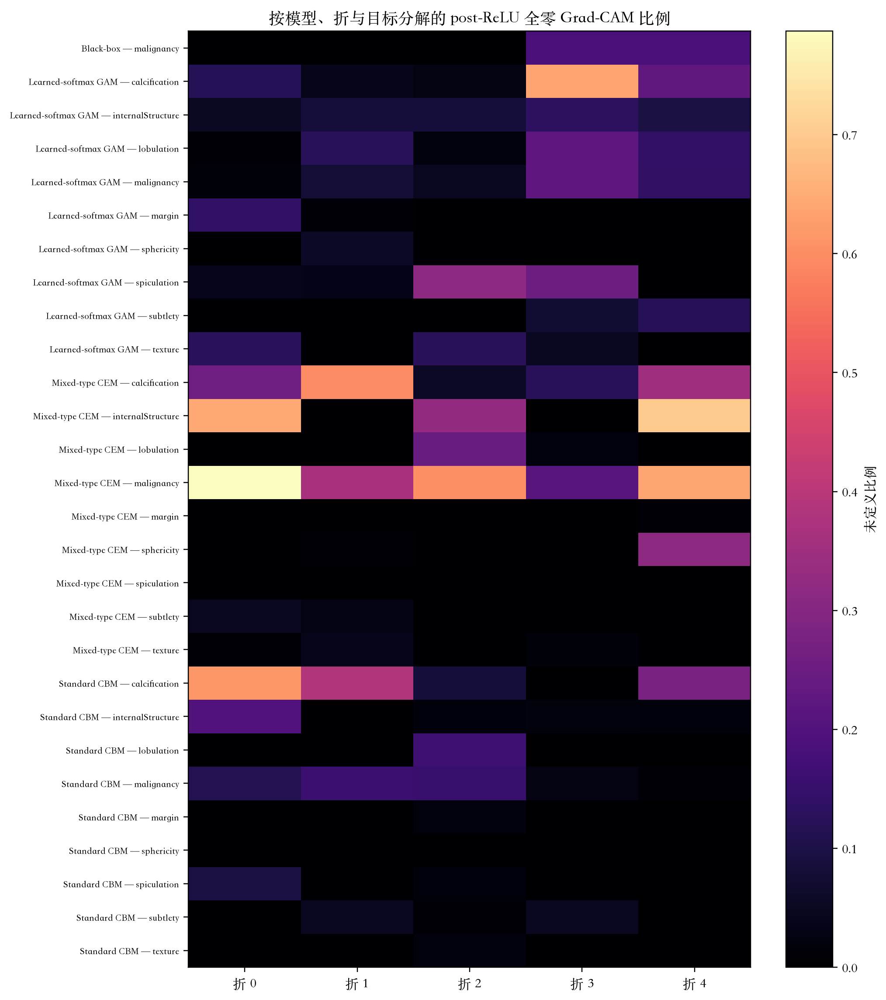

**RPT-F07.** 按模型、折和目标分解的 post-ReLU 全零 Grad-CAM 比例。

这意味着什么？Grad-CAM 是空间敏感度 proxy，不是 ground-truth localisation claim。即使 task prediction 准确，全零图集中与较弱的 matched-random 优势也限制了强空间解释。Display overlay 仅为定性阅读进行归一化；所有定量遮挡结果仍使用原始未归一化 FP32 map。

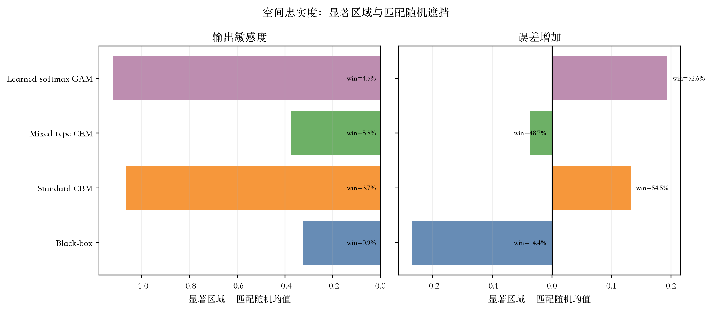

**RPT-F08.** 汇总全部目标的模型级空间忠实度：output_sensitivity 与 error_increase 相对匹配随机遮挡。

### 6.3 结果——WHAT

测量内容是什么？连续概念忠实度在每个概念模型的 2,633 个结节上使用 MAE、RMSE、Pearson 与 Spearman。分类概念忠实度在完整读者投票分布上使用 soft cross-entropy 与 multiclass Brier，并仅在真实众数类别唯一时计算 hard modal macro-F1。表 RPT-T11 与图 RPT-F09A 让连续指标使用兼容量尺；表 RPT-T12 与图 RPT-F09B 对分类证据采用同样策略。

**RPT-T11. 连续概念指标**

| Model | Concept | MAE | RMSE | Pearson | Spearman | N |
| --- | --- | --- | --- | --- | --- | --- |
| Learned-softmax GAM | lobulation | 0.127 | 0.190 | 0.451 | 0.472 | 2633 |
| Learned-softmax GAM | margin | 0.145 | 0.198 | 0.683 | 0.648 | 2633 |
| Learned-softmax GAM | sphericity | 0.140 | 0.178 | 0.424 | 0.435 | 2633 |
| Learned-softmax GAM | spiculation | 0.114 | 0.184 | 0.499 | 0.456 | 2633 |
| Learned-softmax GAM | subtlety | 0.168 | 0.221 | 0.578 | 0.582 | 2633 |
| Learned-softmax GAM | texture | 0.111 | 0.179 | 0.786 | 0.583 | 2633 |
| Mixed-type CEM | lobulation | 0.183 | 0.218 | 0.270 | 0.249 | 2633 |
| Mixed-type CEM | margin | 0.246 | 0.292 | 0.188 | 0.171 | 2633 |
| Mixed-type CEM | sphericity | 0.178 | 0.217 | 0.056 | 0.051 | 2633 |
| Mixed-type CEM | spiculation | 0.180 | 0.216 | 0.305 | 0.274 | 2633 |
| Mixed-type CEM | subtlety | 0.204 | 0.250 | 0.445 | 0.449 | 2633 |
| Mixed-type CEM | texture | 0.265 | 0.305 | 0.202 | 0.167 | 2633 |
| Standard CBM | lobulation | 0.131 | 0.186 | 0.460 | 0.456 | 2633 |
| Standard CBM | margin | 0.146 | 0.197 | 0.687 | 0.647 | 2633 |
| Standard CBM | sphericity | 0.139 | 0.177 | 0.437 | 0.453 | 2633 |
| Standard CBM | spiculation | 0.121 | 0.182 | 0.507 | 0.416 | 2633 |
| Standard CBM | subtlety | 0.169 | 0.223 | 0.567 | 0.573 | 2633 |
| Standard CBM | texture | 0.116 | 0.180 | 0.783 | 0.581 | 2633 |

观察到了什么？连续忠实度随 concept 与 model 显著变化，并不存在单一的全模型模式。部分形态学概念表现出有用相关性，而更微妙或读者变异较大的概念保留较高绝对误差。这种异质性很重要，因为下游概念模型只能解释自身预测表示，而不是无误差的影像学真实状态。

**RPT-T12. 分类概念指标**

| Model | Concept | Soft CE | Brier | Macro-F1 | Soft N | Hard N | Ties |
| --- | --- | --- | --- | --- | --- | --- | --- |
| Learned-softmax GAM | calcification | 0.201 | 0.048 | 0.313 | 2633 | 2578 | 55 |
| Learned-softmax GAM | internalStructure | 0.038 | 0.007 | 0.312 | 2633 | 2625 | 8 |
| Mixed-type CEM | calcification | 0.262 | 0.068 | 0.310 | 2633 | 2578 | 55 |
| Mixed-type CEM | internalStructure | 0.083 | 0.014 | 0.250 | 2633 | 2625 | 8 |
| Standard CBM | calcification | 0.207 | 0.049 | 0.314 | 2633 | 2578 | 55 |
| Standard CBM | internalStructure | 0.039 | 0.007 | 0.250 | 2633 | 2625 | 8 |

分类结果更有限。internalStructure 与 calcification 保留完整投票分布，因此 soft loss 与 Brier score 是权威分布证据。hard modal macro-F1 便于阅读，但排除真实并列，在稀有类别困难时可能较低。把 modal label 当作单一专家 ground truth 会错误描述冻结目标。

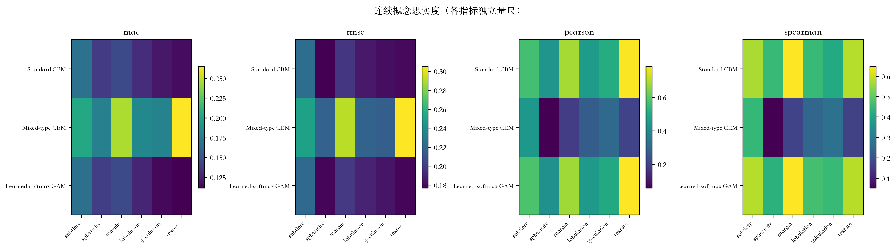

**RPT-F09A.** 使用独立指标量尺呈现连续概念忠实度。

这意味着什么？WHAT 证据支持逐组检查概念，而不是笼统声称模型已经统一学会影像学概念。概念忠实度是透明瓶颈的必要条件，但不足以保证预测优势或干预收益。因此，私有 RPT-TA02 在病例层面同时呈现连续目标与分类投票分布语义。

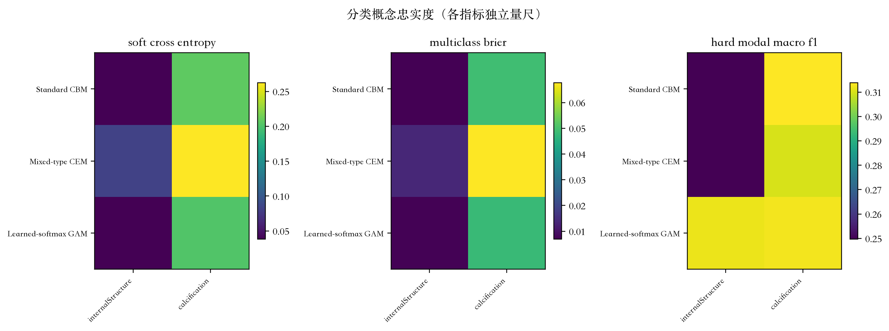

**RPT-F09B.** 使用独立指标量尺呈现分类概念忠实度。

### 6.4 结果——WHY

测量内容是什么？WHY 证据关注预测概念如何进入每个概念模型的恶性评分。每一折使用 train-only mean 对原始 group term 进行中心化；中心化 bias 与八个 term 在冻结 1e-6 tolerance 内重建 task score。表 RPT-T15 记录 pooled signed mean 与逐折 centering constants，但不会把它们改称 importance。

**RPT-T15. 中心化贡献汇总**

| Model | Concept | Pooled signed mean (rating points) | Role within model |
| --- | --- | --- | --- |
| Standard CBM | calcification | 0.400 | Most positive |
| Standard CBM | texture | -0.122 | Most negative |
| Mixed-type CEM | internalStructure | 0.486 | Most positive |
| Mixed-type CEM | texture | 0.101 | Most positive |
| Learned-softmax GAM | calcification | 0.402 | Most positive |
| Learned-softmax GAM | lobulation | -0.016 | Most negative |

观察到了什么？不同 concept 与 model 的有符号贡献方向不同，说明相同 concept name 不一定具有相同决策角色。图 RPT-F10 把冻结逐样本点做成经验 OOF profile。该 profile 仅为描述性展示，不能读作 global causal shape function。权威 model-by-concept mean absolute aggregate 未持久化，因此报告将其标记为 DATA_NOT_PERSISTED，而不重新计算。

**RPT-T16. Learned-softmax GAM 逐折 alpha**

| Fold | Concept | Expert 1 | Expert 2 | Expert 3 | Expert 4 | Expert 5 | Min–max | Simplex |
| --- | --- | --- | --- | --- | --- | --- | --- | --- |
| 0 | calcification | 0.200 | 0.200 | 0.204 | 0.196 | 0.199 | 0.196–0.204 | 1.000 |
| 0 | internalStructure | 0.200 | 0.200 | 0.200 | 0.200 | 0.200 | 0.200–0.200 | 1.000 |
| 0 | lobulation | 0.201 | 0.203 | 0.198 | 0.200 | 0.197 | 0.197–0.203 | 1.000 |
| 0 | margin | 0.198 | 0.198 | 0.203 | 0.202 | 0.200 | 0.198–0.203 | 1.000 |
| 0 | sphericity | 0.199 | 0.200 | 0.200 | 0.202 | 0.200 | 0.199–0.202 | 1.000 |
| 0 | spiculation | 0.194 | 0.200 | 0.200 | 0.200 | 0.207 | 0.194–0.207 | 1.000 |
| 0 | subtlety | 0.206 | 0.195 | 0.198 | 0.202 | 0.198 | 0.195–0.206 | 1.000 |
| 0 | texture | 0.201 | 0.200 | 0.199 | 0.200 | 0.200 | 0.199–0.201 | 1.000 |
| 1 | calcification | 0.195 | 0.191 | 0.201 | 0.201 | 0.211 | 0.191–0.211 | 1.000 |
| 1 | internalStructure | 0.201 | 0.199 | 0.199 | 0.199 | 0.201 | 0.199–0.201 | 1.000 |
| 1 | lobulation | 0.197 | 0.199 | 0.203 | 0.206 | 0.195 | 0.195–0.206 | 1.000 |
| 1 | margin | 0.202 | 0.200 | 0.199 | 0.199 | 0.201 | 0.199–0.202 | 1.000 |
| 1 | sphericity | 0.199 | 0.199 | 0.201 | 0.199 | 0.202 | 0.199–0.202 | 1.000 |
| 1 | spiculation | 0.200 | 0.203 | 0.205 | 0.195 | 0.197 | 0.195–0.205 | 1.000 |
| 1 | subtlety | 0.203 | 0.200 | 0.196 | 0.201 | 0.200 | 0.196–0.203 | 1.000 |
| 1 | texture | 0.202 | 0.200 | 0.199 | 0.198 | 0.201 | 0.198–0.202 | 1.000 |
| 2 | calcification | 0.200 | 0.196 | 0.206 | 0.199 | 0.199 | 0.196–0.206 | 1.000 |
| 2 | internalStructure | 0.199 | 0.199 | 0.201 | 0.201 | 0.201 | 0.199–0.201 | 1.000 |
| 2 | lobulation | 0.196 | 0.202 | 0.206 | 0.192 | 0.204 | 0.192–0.206 | 1.000 |
| 2 | margin | 0.201 | 0.199 | 0.198 | 0.200 | 0.202 | 0.198–0.202 | 1.000 |
| 2 | sphericity | 0.200 | 0.202 | 0.199 | 0.199 | 0.201 | 0.199–0.202 | 1.000 |
| 2 | spiculation | 0.207 | 0.201 | 0.202 | 0.196 | 0.193 | 0.193–0.207 | 1.000 |
| 2 | subtlety | 0.198 | 0.201 | 0.202 | 0.198 | 0.201 | 0.198–0.202 | 1.000 |
| 2 | texture | 0.201 | 0.199 | 0.199 | 0.199 | 0.201 | 0.199–0.201 | 1.000 |
| 3 | calcification | 0.198 | 0.203 | 0.200 | 0.196 | 0.202 | 0.196–0.203 | 1.000 |
| 3 | internalStructure | 0.201 | 0.200 | 0.199 | 0.199 | 0.201 | 0.199–0.201 | 1.000 |
| 3 | lobulation | 0.195 | 0.214 | 0.195 | 0.197 | 0.200 | 0.195–0.214 | 1.000 |
| 3 | margin | 0.200 | 0.203 | 0.199 | 0.200 | 0.198 | 0.198–0.203 | 1.000 |
| 3 | sphericity | 0.201 | 0.199 | 0.200 | 0.201 | 0.198 | 0.198–0.201 | 1.000 |
| 3 | spiculation | 0.203 | 0.203 | 0.192 | 0.200 | 0.201 | 0.192–0.203 | 1.000 |
| 3 | subtlety | 0.198 | 0.202 | 0.200 | 0.199 | 0.201 | 0.198–0.202 | 1.000 |
| 3 | texture | 0.200 | 0.199 | 0.200 | 0.201 | 0.199 | 0.199–0.201 | 1.000 |
| 4 | calcification | 0.203 | 0.206 | 0.195 | 0.193 | 0.202 | 0.193–0.206 | 1.000 |
| 4 | internalStructure | 0.200 | 0.201 | 0.199 | 0.201 | 0.199 | 0.199–0.201 | 1.000 |
| 4 | lobulation | 0.190 | 0.203 | 0.204 | 0.206 | 0.198 | 0.190–0.206 | 1.000 |
| 4 | margin | 0.201 | 0.200 | 0.199 | 0.200 | 0.201 | 0.199–0.201 | 1.000 |
| 4 | sphericity | 0.199 | 0.199 | 0.202 | 0.199 | 0.201 | 0.199–0.202 | 1.000 |
| 4 | spiculation | 0.198 | 0.201 | 0.198 | 0.203 | 0.199 | 0.198–0.203 | 1.000 |
| 4 | subtlety | 0.196 | 0.200 | 0.200 | 0.203 | 0.201 | 0.196–0.203 | 1.000 |
| 4 | texture | 0.199 | 0.199 | 0.200 | 0.202 | 0.200 | 0.199–0.202 | 1.000 |

Learned-softmax GAM 增加第二层 WHY：每个 concept 的五个 expert output 由非负且和为一的权重混合。表 RPT-T16 与图 RPT-F11 表明，权重偏离均匀的 0.2 初始化，但很多变化较小且依赖 fold。学习到的 mixture 是 optimisation evidence，并不能证明每个 expert 对应不同临床机制。

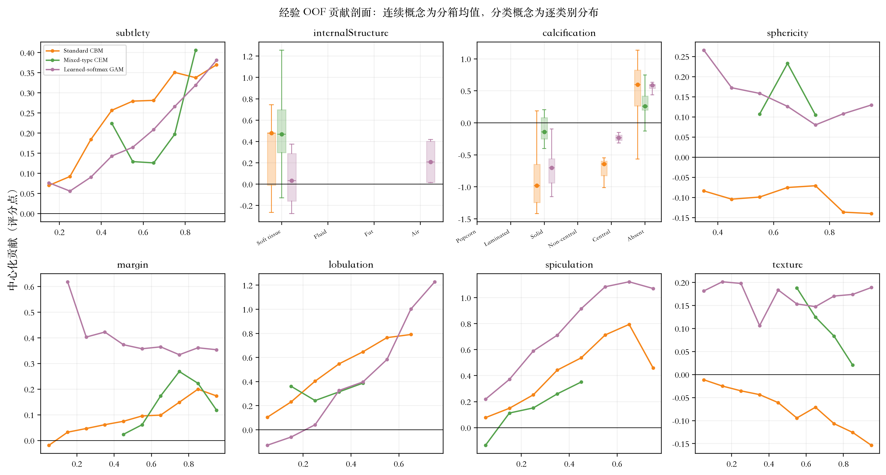

**RPT-F10.** 经验 OOF 贡献剖面：连续概念分箱均值与分类概念贡献分布；仅为描述性结果，并非因果关系。

这意味着什么？贡献分解让评分构成可审计，并支持病例层面有符号 bar，但 magnitude 与 sign 仍是训练决策函数的属性，不能验证底层概念或建立临床因果关系。私有定性附录把 contribution bar 与 CT context、concept prediction/target evidence 配对，避免 WHY 脱离 WHAT 与 Prediction。

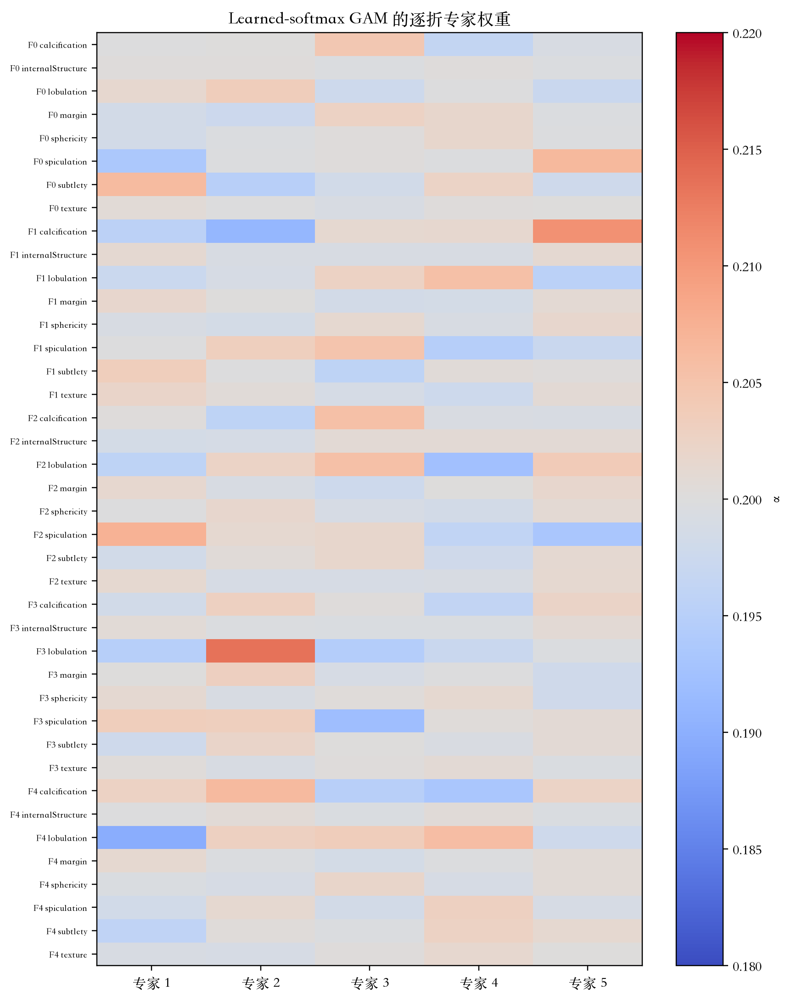

**RPT-F11.** Learned-softmax GAM 的逐折专家混合权重。

### 6.5 结果——HOW

测量内容是什么？概念干预按照预注册的模型特定语义替换 0…8 个 group。对每个 k，先拼接五折 OOF prediction，再计算主要 MAE 与次要 AUROC。random-permutation curve 对每折 100 个确定性 permutation 求均值；error-first 使用连续绝对误差或分类 total-variation distance 排序，不使用 malignancy target。

**RPT-T17. 概念干预汇总**

| Model | Ordering | Baseline MAE | k=4 MAE | k=8 MAE | iMAE | Delta_iMAE | Baseline AUROC | iAUC | Delta_iAUC |
| --- | --- | --- | --- | --- | --- | --- | --- | --- | --- |
| Learned-softmax GAM | error_first | 0.480 | 0.505 | 0.507 | 0.497 | -0.016 | 0.949 | 0.932 | -0.017 |
| Learned-softmax GAM | random_permutation | 0.480 | 0.479 | 0.507 | 0.484 | -0.003 | 0.949 | 0.943 | -0.006 |
| Mixed-type CEM | error_first | 0.484 | 0.440 | 0.436 | 0.445 | 0.040 | 0.942 | 0.960 | 0.018 |
| Mixed-type CEM | random_permutation | 0.484 | 0.454 | 0.436 | 0.456 | 0.028 | 0.942 | 0.954 | 0.013 |
| Standard CBM | error_first | 0.502 | 0.510 | 0.508 | 0.506 | -0.004 | 0.933 | 0.922 | -0.011 |
| Standard CBM | random_permutation | 0.502 | 0.500 | 0.508 | 0.501 | 0.001 | 0.933 | 0.929 | -0.004 |

观察到了什么？Mixed-type CEM 是唯一表现出强而一致 integrated MAE 收益的模型：random permutation 下 Delta_iMAE 为 +0.028，error-first 下为 +0.040。Standard CBM 在随机顺序下近似中性（+0.001），error-first 下轻微不利（−0.004）。Learned-softmax GAM 在部分早期 k 位置有有限收益，但 integrated Delta_iMAE 总体为负（random −0.003；error-first −0.016）。表 RPT-T17 保留 baseline、intermediate、k=8、iMAE、Delta_iMAE、iAUC 与 Delta_iAUC；图 RPT-F12 展示完整 k=0…8 曲线。

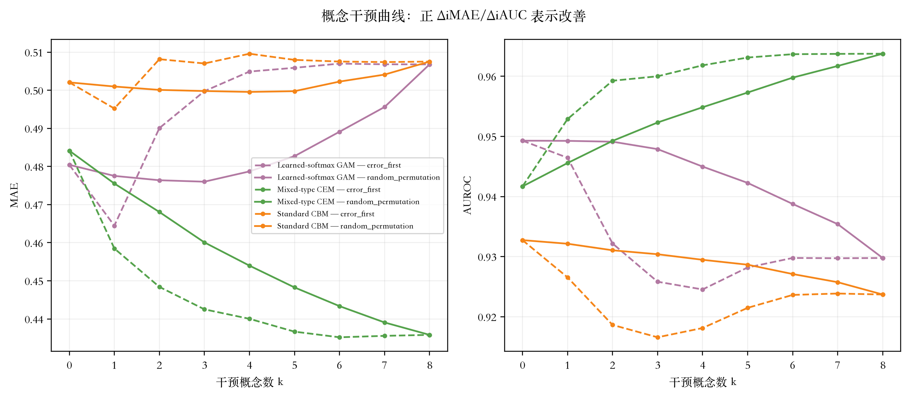

**RPT-F12.** 随机顺序与 error-first 顺序下的 k=0…8 概念干预曲线。

error-first 并不始终优于随机顺序。首先纠正当前预测误差最大的概念，可能暴露模型其他位置的补偿误差；后续干预还可能逆转早期收益。这是重要负面结果，表明概念纠正不是单调 repair operation。

这意味着什么？概念忠实度与可干预性不能互换。GAM 可以较好预测概念，但 integrated substitution 传播后总体不利；CEM 的部分概念忠实度较弱，却从纠正中获益最大。HOW 检验模型对内部概念表示的依赖，而不是改变患者影像学表现的因果效应。RPT-FA06 的病例级 before/after 值未持久化，因此 HOW 继续标记为 DATA_NOT_PERSISTED，不作重算。

### 6.6 综合解释

Prediction、WHERE、WHAT、WHY、HOW 回答不同问题，不能压缩为单一 explainability score。Prediction 建立 task performance；WHERE 测试空间敏感性，但受全零图和较弱 matched-random 优势限制；WHAT 衡量命名概念是否匹配读者证据；WHY 暴露评分构成；HOW 探查纠正表示是否改变输出。

**RPT-T18. WHERE-WHAT-WHY-HOW 综合表**

| Layer | Question | Main evidence | Boundary |
| --- | --- | --- | --- |
| Prediction | How accurately is malignancy scored? | Learned-softmax GAM has the lowest point-estimate MAE; paired support is model-dependent. | Radiologist assessment, not pathology. |
| WHERE | Where is the output spatially sensitive? | 66,769 valid maps; saliency often did not exceed matched random masks. | 6,955 post-ReLU zero maps; exact mechanism unavailable. |
| WHAT | Which concepts were predicted? | Continuous fidelity varied by concept; categorical hard-F1 was limited. | Categorical targets are reader-vote distributions. |
| WHY | How do concepts enter the score? | Signed centered terms and learned GAM mixtures reconstruct the score. | Centering constants are not importance; mean absolute aggregate was not persisted. |
| HOW | How does correcting concepts alter prediction? | Benefit was strong and consistent for CEM, near-neutral for CBM, and unfavorable overall for GAM despite limited early gains. | Concept fidelity and intervenability are not interchangeable; interventions are not causal clinical effects. |

只有把这些层一起阅读，才能形成对模型最强的综合解释。Learned-softmax GAM 具有最佳主要点估计，多个概念组忠实度较强，但 integrated intervention response 总体不利。Mixed-type CEM 的主要 MAE 优于 Black-box 与 Standard CBM，并且即使部分概念忠实度较弱，仍从干预中获得最一致收益。Standard CBM 简单、可追溯，却几乎没有 task 或 intervention 优势。

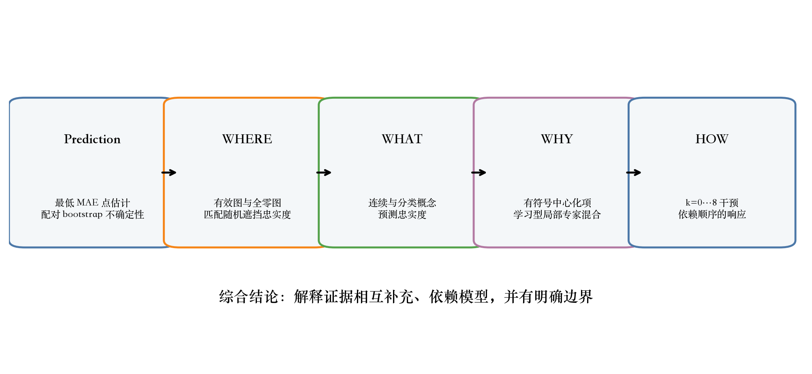

**RPT-F13.** Prediction-WHERE-WHAT-WHY-HOW 的综合解释及其边界。

因此，表 RPT-T18 与图 RPT-F13 呈现的是支持性 claim 与 boundary 链，而不是 winner-takes-all dashboard。结论是解释性具有多维度并依赖模型：有用解释必须说明它支持哪个层面、依赖什么冻结证据，以及不能建立什么。

## 7. 讨论

主要结果在点估计层面支持 Learned-softmax GAM；配对 MAE 比较支持其相对 Black-box 与 Standard CBM 的实质改善。这说明显式 concept-local nonlinearity 可以在保留加性分解的同时改善连续评分。然而，confidence interval 与次要判别结果阻止过度简单的排名：最佳回归点估计不等于在所有配对中 AUROC 都具有统计优势。

解释层揭示了单独预测指标看不到的 trade-off。GAM 同时具有最佳 task 点估计和多个组较强概念忠实度，但 integrated intervention 总体为负。CEM 的 task 点估计优于 Black-box 与 Standard CBM，并在部分概念忠实度较弱的同时获得最强纠正收益。Standard CBM 透明且某些概念预测较好，却几乎没有 task 或 intervention 优势。因此，prediction、concept fidelity、intervenability 与 spatial faithfulness 是不同属性，不能互换为同一个解释性定义。

空间证据提供最明确的谨慎信号。数千个合法 post-ReLU 全零图，以及总体较弱的 saliency-versus-random difference，意味着视觉上漂亮的 overlay 不应主导科学故事。Grad-CAM overlay 最适合被视为局部 sensitivity view；只有定量忠实度与 map-validity accounting 同时支持时，其可信度才增强。

从临床角度看，该框架提供的是规范沟通模型行为的方法，而不是诊断。读者评分编码影像学评估与分歧，并不建立组织病理学真实。任何临床主张都需要外部验证、部署校准、前瞻性流程测试与病理关联结局。

模型选择因此取决于预期科学用途。若只选最低 MAE，会偏向 GAM；若只看 intervention response，会偏向 CEM；若只看架构简单性，则可能偏向 Standard CBM。现有证据不支持把这些准则事后合并成单一排名。预测基准、concept error 检查、评分构成分解，以及表示依赖的受控测试，是相关但不同的目标。

负面结果因此不是附带现象，而是重要信息。概念忠实度与干预收益之间的不匹配说明，预测较好的 bottleneck 不一定是有效纠错接口；较弱或负的 matched-random 空间对比说明 heatmap 需要定量核验；undefined map 集中则说明缺失空间解释必须被计数，不能静默丢弃。这些发现缩小了 claim，却使最终解读更可复现。

## 8. 局限性

第一，目标是放射科医师评估恶性评分，而不是病理确诊疾病。患者分组内部 cross-validation 控制 leakage，但不能建立对其他机构、扫描仪分布或临床流程的 transportability。每折只使用一个预注册 seed，因此 bootstrap interval 描述患者抽样不确定性，而不是训练 seed variability。

第二，concept ground truth 继承读者变异。连续均值压缩分歧，分类 vote distribution 可能稀疏。hard modal macro-F1 排除真实并列，并且次于完整分布指标。概念干预把内部表示替换为 reader-derived target，不能解释为可行临床操作或因果效应。

第三，Grad-CAM 是结节层面空间 proxy。6,955 个 undefined map 被确认为 finite post-ReLU 全零图，但精确 pre-ReLU/gradient mechanism 未持久化。因此，观察到的集中分布被报告为 SYSTEMATIC_MODEL/TARGET_ISSUE；在不允许新增 forward pass 的情况下，不能进一步断言是 zero gradient、zero channel weight 或 negative weighted sum。

最后，部分展示目标受冻结内容限制。model-by-concept mean absolute centered contribution aggregate 与病例级 intervention before/after trajectory 未持久化。因此贡献表只报告有来源支持的 signed mean，并仅在一处说明该限制；报告不会把描述性绘图或叙述记忆转成新的权威科学结果。

## 9. 结论

这项统一比较表明，预测与解释应作为一系列不同问题进行评估。Learned-softmax GAM 获得最低主要 MAE 点估计；配对不确定性同时指出该优势在哪些比较中明确、哪些比较中不明确。概念模型增加 Black-box predictor 无法提供的可检查表示、有符号评分分解与干预实验。

解释证据也带来具有实际意义的限制。只有 CEM 表现出强而一致的 integrated intervention benefit；CBM 近似中性，GAM 尽管早期有有限收益但总体不利。因此，概念忠实度不能预测可干预性。Grad-CAM map 也可能 undefined，显著区域遮挡经常不能优于匹配随机遮挡。这些结果决定每类解释能被多强地解读。

最终框架支持对放射科医师评估肺结节恶性程度进行透明、可复现的研究报告。它不建立病理层级诊断、因果概念、ground-truth localisation 或临床就绪性。其核心贡献是构建连接 Prediction、WHERE、WHAT、WHY、HOW 的可复现证据结构，同时让每个 claim 绑定冻结来源与解释边界。

## 公开可复现性附录

全部科学数值都来自用户批准的 2,395-item Results Catalogue 及其注册的冻结来源。报告修订 supplement 绑定 Catalogue registry SHA、Catalogue manifest SHA 与两份已批准计划文档 SHA。section manifest 与 reverse-traceability row 把每个渲染 table、figure、caption、conclusion code 连接到 Catalogue item ID 与 source hash。

P5–P9 checkpoint、history、prediction、metric、evaluation、OOF row、intervention、Grad-CAM map、occlusion row 与 faithfulness payload 保持只读。报告生成不进行训练、model forward pass、test inference、bootstrap recomputation 或新 scientific job。私有 archive 保持在 Git 之外，并用 opaque CASE label 保存全分辨率病例资产。

Archive 包含 1,698 个文件、14,386,651,621 bytes，并由完成的 SHA-verified manifest 保护。六份 mandatory PDF 在 150 DPI 下用 Poppler 逐页渲染，通过 contact sheet 与原始分辨率页面检查，并使用 pypdf/pdfplumber 核对 metadata、text、numbering、font 与 page integrity，之后 P10 才能进入 AWAITING_USER_APPROVAL。

## 参考文献

[1] S. G. Armato III et al., "The Lung Image Database Consortium (LIDC) and Image Database Resource Initiative (IDRI): A completed reference database of lung nodules on CT scans," Med. Phys., vol. 38, no. 2, pp. 915–931, 2011, doi: 10.1118/1.3528204.

[2] G. Huang, Z. Liu, L. van der Maaten, and K. Q. Weinberger, "Densely Connected Convolutional Networks," in Proc. IEEE Conf. Comput. Vis. Pattern Recognit. (CVPR), pp. 4700–4708, 2017, doi: 10.1109/CVPR.2017.243.

[3] P. W. Koh et al., "Concept Bottleneck Models," in Proc. 37th Int. Conf. Mach. Learn. (ICML), PMLR, vol. 119, pp. 5338–5348, 2020.

[4] M. Espinosa Zarlenga et al., "Concept Embedding Models: Beyond the Accuracy–Explainability Trade-Off," in Adv. Neural Inf. Process. Syst., vol. 35, pp. 21400–21413, 2022.

[5] T. Hastie and R. Tibshirani, "Generalized Additive Models," Stat. Sci., vol. 1, no. 3, pp. 297–318, 1986, doi: 10.1214/ss/1177013604.

[6] R. R. Selvaraju et al., "Grad-CAM: Visual Explanations from Deep Networks via Gradient-Based Localization," in Proc. IEEE Int. Conf. Comput. Vis. (ICCV), pp. 618–626, 2017, doi: 10.1109/ICCV.2017.74.

[7] S. Shin, Y. Jo, S. Ahn, and N. Lee, "A Closer Look at the Intervention Procedure of Concept Bottleneck Models," in Proc. 40th Int. Conf. Mach. Learn. (ICML), PMLR, vol. 202, pp. 31504–31520, 2023.

[8] R. I. Dumaev, S. A. Molodyakov, and L. V. Utkin, "Concept-based Explainable Malignancy Scoring on Pulmonary Nodules in CT Images," arXiv:2405.17483, 2024, doi: 10.48550/arXiv.2405.17483.

[9] W. Shen et al., "Multi-crop Convolutional Neural Networks for Lung Nodule Malignancy Suspiciousness Classification," Pattern Recognit., vol. 61, pp. 663–673, 2017, doi: 10.1016/j.patcog.2016.05.029.

[10] B. Efron, "Bootstrap Methods: Another Look at the Jackknife," Ann. Stat., vol. 7, no. 1, pp. 1–26, 1979, doi: 10.1214/aos/1176344552.
